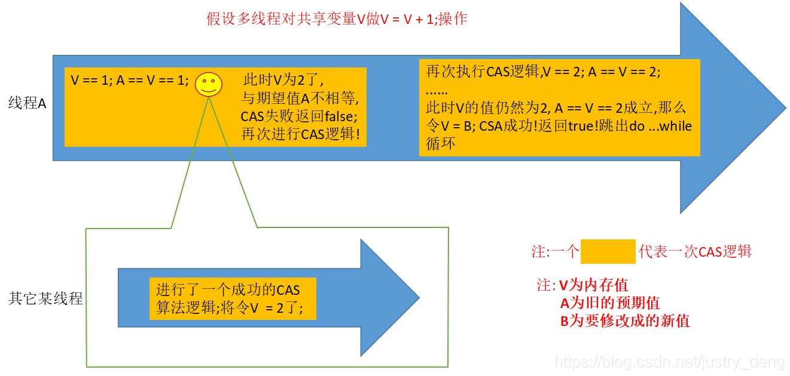

- CAS （Compare And Swap）是一种无锁算法，是乐观锁的一种实现。有三个操作值：
	- 1. 内存值 V
	- 2. 旧的预期值 A
	- 3. 要修改的新值 B
	- **当且仅当预期值A和内存值V相同时，将内存值V修改为B并返回true，否则返回false。**
- # CAS 原理简述
	- 
	- 某一线程执行一个 CAS 逻辑，如果中途有其他线程修改了共享变量的值，导致这个线程的 CAS 逻辑运算后得到的值与期望结果不一致，那么这个线程会再次执行 CAS 逻辑(这里是一个 do while 循环)，直到成功为止。
	  
	  注意上图，执行 CAS 逻辑的时候会将预期值 A 修改为 2。
- # ABA 问题
	- 是指线程获取到值与进行 CAS 逻辑之间的时间差里，其他线程对内存值进行了修改，然后又将内存值改回去，虽然此时当前线程仍能够 CAS 成功，但是中间多出的过程可能引发问题。
	- 对于普通的数值类型，多次修改可能不会有太大影响，最终结果还是一样的；如果是链表等引用类型，可能修改原有的数据结构导致错误。
- # 解决 ABA 问题
	- 可以将值添加一个标识，如果对值进行修改，则对标识进行计数。进行 CAS 时除了对比值的之外，还要对比标识是否一致。
	- 在Java中，`AtomicMarkableReference<V>`、`AtomicStampedReference<V>`也实现了这个作用