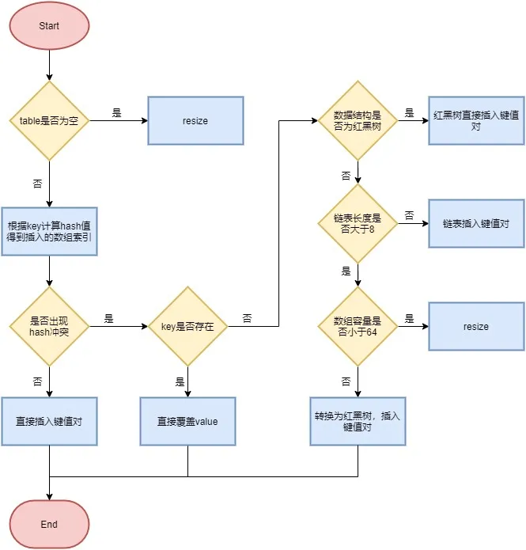

- # 底层数据结构
- Java 的 HashMap是用链地址法（拉链法）构造的。
- JDK 7 中，HashMap 由“**数组+链表**”组成，数组是 HashMap 的主体，链表则是主要为了解决哈希冲突而存在的。
- 在 JDK 8 中，HashMap 由“**数组+链表+红黑树**”组成。
	- 改进原因：链表过长会影响HashMap的性能，其搜索复杂度为`O(n)`，而红黑树是`O(logn)`。
	- 转换条件：当链表超过 8 且数据总量超过 64 时会转红黑树。当数组的长度小于64时，会优先数组扩容。
		- 为什么链表长度超过8才转换：理想情况下的容器中节点在hash桶（数组）中的分布频率，符合泊松分布。按照泊松分布的公式计算出桶中元素个数和概率的对照表，可以看到链表中元素个数为 8 时的概率已经非常小，再多的就更少了。**减少了转换和维护红黑树的次数，在链表长度较小的情况下其搜索时间复杂度可接受。**
- # 存储过程
- 根据`key`计算出其哈希值`h`，将其右移16位，再做异或操作。目的是：混合了原哈希值中的高位和低位，增大了随机性，开销也不大。
  logseq.order-list-type:: number
	- ```java
	  static final int hash(Object key) {
	      int h;
	      return (key == null) ? 0 : (h = key.hashCode()) ^ (h >>> 16);
	  }
	  ```
- 做取模运算，获取到在数组中的下标位置：`i = (length - 1) & hash`。
  logseq.order-list-type:: number
	- 当 `length` 总是 2 的n次方时，等价于对length取模，也就是 `hash % length`。
	- 把 hash 值对数组长度取模运算，模运算的消耗很大，没有位运算快。
- 如果对应下标位置，判断是否哈希冲突
  logseq.order-list-type:: number
	- 没有冲突，即该数组位置为空，则放入数据。
	  logseq.order-list-type:: number
	- 如果冲突，查看节点结构
	  logseq.order-list-type:: number
		- 节点上的key与目标key一致，直接覆盖掉
		  logseq.order-list-type:: number
		- 如果节点上的key不一致，查看其是否是红黑树，是的话将其挂在树上
		  logseq.order-list-type:: number
		- 不是红黑树而是链表的话，判断其长度与数组容量
		  logseq.order-list-type:: number
			- 如果长度小于8，则插入键值对，若 key 存在，就覆盖掉 value
			  logseq.order-list-type:: number
			- 如果长度大于 8 并且数组容量小于 64，就进行扩容
			  logseq.order-list-type:: number
			- 如果长度大于 8 并且数组的容量大于 64，则将这个结构转换为红黑树，并插入数值
			  logseq.order-list-type:: number
- 判断实际存在的键值对数量size是否超多了最大容量`threshold`，如果超过，进行扩容。
  logseq.order-list-type:: number
- {:height 601, :width 557}
- # 扩容机制
- 扩容`resize`即，数组键值对数量`size`超过了最大容量临界值`THRESHOLD = INITIAL_CAPACITY * LOAD_FACTOR`（临界值 = 容量 * 加载因子）时，数组扩充，节点迁移的过程。
- 加载因子为0.75原因：分布频率符合柏松分布；容量为2的n次幂，乘积为整数。
- 过程：
	- 数组长度变为原来的两倍，新建数组
	  logseq.order-list-type:: number
	- 将数据转移到新的数组：
	  logseq.order-list-type:: number
- **JDK1.8 优化过程**
	- 1. 不需要重新计算哈希值：由于扩容为两倍，不需要重新计算哈希值，只需要将hash值与数组长度进行与操作后，结果为`0`放在原索引处，结果为`1`放在新索引（原索引 + oldCap）
	- 2. 迁移链表的过程中，节点头插法改为尾插法，避免了链表倒置，以及多线程场景下可能出现的环形链表死循环问题。
- # 线程安全问题
- HashMap线程不安全的原因：
	- 死循环问题：resize过程中，头插法导致链表倒置，可能会导致死循环。在1.8中采用尾插法解决。
	  logseq.order-list-type:: number
	- 数据覆盖问题：多线程情况下，计算的数组下标位置相同时，会造成前一个key被后一个key覆盖，导致元素丢失。
	  logseq.order-list-type:: number
	- get到null数据：线程 A 执行put时，因为元素个数超出阈值而出现扩容，线程B 此时执行get，原数组可能还为迁移到新数组，导致获取数据失败。
	  logseq.order-list-type:: number
- 解决方式：
	- 给HashMap加锁
	  logseq.order-list-type:: number
	- 使用HashTable，实质上是在HashMap的每一个方法上加synchronized锁
	  logseq.order-list-type:: number
	- 使用 **ConcurrentHashMap**，目的是为了**减小锁粒度，减少线程竞争**。
	  logseq.order-list-type:: number
- ## ConcurrentHashMap
- 实现原理：
	- 1.7:使用**分段锁**，将整个数据结构分段存储，然后给每一段数据配一把锁（继承ReentrantLock），当一个线程占用锁访问其中一个段的数据的时候，其他段的数据仍然能被其他线程访问，能够实现真正的并发访问。线程获取锁的过程为自旋。put过程需要两次计算hash
	- 1.8：**CAS + Synchronized + 红黑树**。数据结构几乎与HashMap一致
		- 锁粒度：取消分段锁，而是对数组元素加synchronized锁，并发提高
		- 扩容：所有键值对重新rehash到新表(nextTable)中后，用nextTable将table替换。这就避免了HashMap中get和扩容并发时，可能get到null的问题。在整个过程中，共享变量的存储和读取全部通过`volatile`或`CAS`的方式，保证了线程安全。
- CAS参见：[[CAS与ABA问题]]