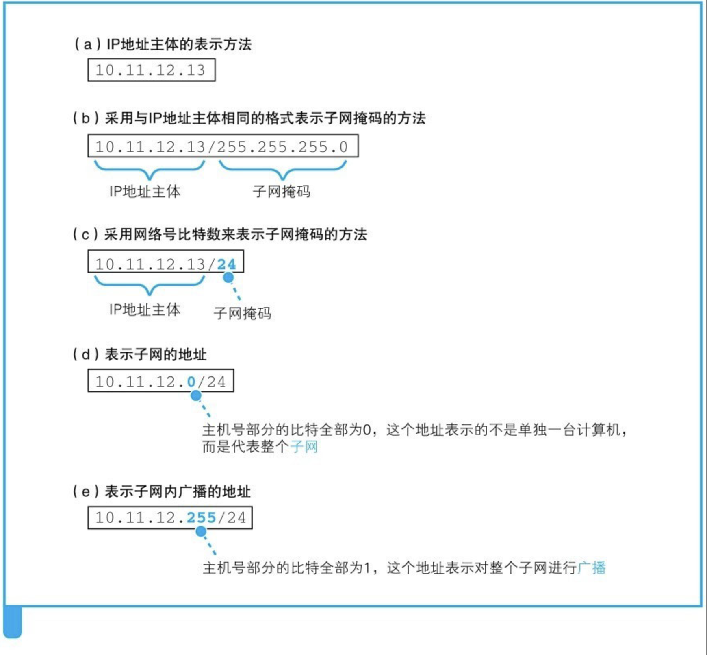
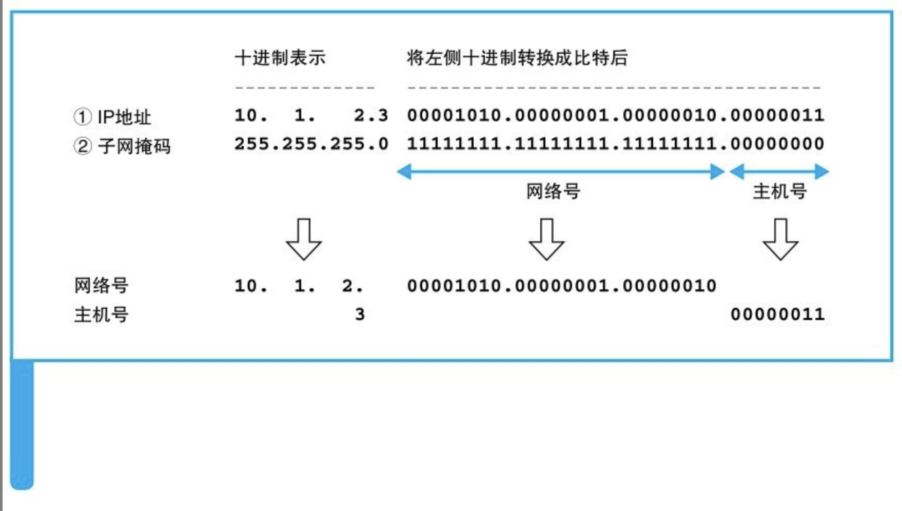

- IP地址是一串32比特的数字（IPv4），按照8比特（1字节）为一组分成4组，分别用十进制表示然后再用圆点隔开。
- 这就是我们平常经常见到的IP地址格式，但仅凭这一串数字我们无法区分哪部分是网络号，哪部分是主机号。在IP地址的规则中，网络号和主机号连起来总共是32比特，但这两部分的具体结构是不固定的。
- 
- # 子网掩码
- 因此需要子网掩码来来表示IP地址的内部结构。子网掩码是一段与IP地址长度相同的32位数字，其左边一半是1，右边一半为0。子网掩码与IP地址如下图对应，其中子网掩码为1的部分表示网络号，子网掩码为0的部分表示主机号。这种写法太长，我们也可以把1的部分的数目用十进制表示，并写在IP地址的右侧，如192.168.0.0/16。
- 
- 主机号部分的比特全部为0或者全部为1时代表两种特殊的含义。主机号部分全部为0代表整个子网而不是子网中的某台设备。此外，主机号部分全部为1代表向子网上所有设备发送包，即广播。