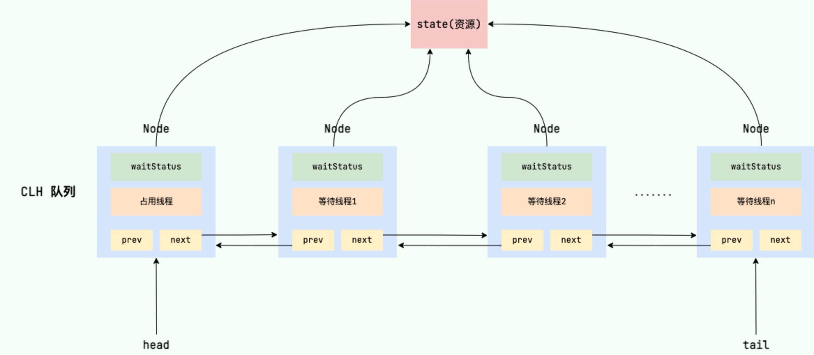

- AQS 的全称为 `AbstractQueuedSynchronizer`，即抽象队列同步器，是一个位于`java.util.concurrent.locks`包下的抽象类，主要用于构建锁和同步器，提供了一些通用的功能（模板方法模式）。
- 使用 AQS 能够简单且高效地构造出应用广泛的大量同步器，如`ReentrantLock`，`Semaphore`，其他的诸如 `ReentrantReadWriteLock`，`SynchronousQueue`等。
- ## 原理
	- ### AQS 核心思想
		- 如果被请求的共享资源空闲，则将当前线程设置为有效的工作线程，并将共享资源设置为锁定状态。
		  logseq.order-list-type:: number
		- 如果被请求的共享资源被占用，那么就需要一套线程阻塞等待，以及被唤醒时锁分配的机制。这个机制 AQS 是基于 CLH 锁实现的，也就是将等待的线程加入到队列中。
		  logseq.order-list-type:: number
		- > CLH 是对自旋锁的改进，形似一个链表，拥有一个指向队列末端的队尾指针；AQS 将其改造为双向链表，且将自旋操作修改为阻塞线程操作。详见：[Java AQS 核心数据结构-CLH 锁](https://mp.weixin.qq.com/s/jEx-4XhNGOFdCo4Nou5tqg)
	- ### AQS 核心原理
		- AQS 使用 int 成员变量 `state` 来表示同步状态，通过内置的同步队列来完成资源线程的排队工作。
		- 核心原理图：
		  collapsed:: true
			- 
		- `state` 变量由 `volatile` 修饰，用于展示当前临界资源的获锁情况：`private volatile int state`
	- ### AQS 资源共享方式
		- AQS 定义两种资源共享方式：
			- 独占`Exclusive`，只有一个线程能够执行，如`ReentrantLock`；
			- 共享`Share`，多个线程可同时执行，如`Semaphore`/`CountDownLatch`。
	- ### AQS 自定义同步器
		- 同步器的设计是基于模板方法模式的，因此自定义方式与实现接口的方法有很大的区别。
		- 如果需要自定义同步器：
			- 继承`AbstractQueuedSynchronizer` 并重写指定的方法。
			  logseq.order-list-type:: number
			- 将上述 AQS **组合**到自定义同步组件中，并调用其模板方法，而这些模板方法会调用上述重写的方法。
			  logseq.order-list-type:: number
		- 自定义同步器需要重写的方法有：
		  collapsed:: true
			- ```java
			  //独占方式。尝试获取资源，成功则返回true，失败则返回false。
			  protected boolean tryAcquire(int)
			  //独占方式。尝试释放资源，成功则返回true，失败则返回false。
			  protected boolean tryRelease(int)
			  //共享方式。尝试获取资源。负数表示失败；0表示成功，但没有剩余可用资源；正数表示成功，且有剩余资源。
			  protected int tryAcquireShared(int)
			  //共享方式。尝试释放资源，成功则返回true，失败则返回false。
			  protected boolean tryReleaseShared(int)
			  //该线程是否正在独占资源。只有用到condition才需要去实现它。
			  protected boolean isHeldExclusively()
			  ```
		- 一个示例：[[自定义一个 AQS]]
- # 常见的同步工具类
	- ### ReentrantLock
		- [[ReentrantLock 的使用与原理]]
		- 它的内部维护了一个 `state` 变量，用来表示锁的占用状态。`state` 的初始值为 0，表示锁处于未锁定状态。
		- 当线程 A 调用 `lock()` 方法时，会尝试通过 `tryAcquire()` 方法独占该锁，并让 `state` 的值加 1。
			- 如果成功了，那么线程 A 就获取到了锁。
			- 如果失败了，那么线程 A 就会被加入到一个等待队列（CLH 队列）中，直到其他线程释放该锁。
		- 假设线程 A 获取锁成功了，释放锁之前，A 线程自己是可以重复获取此锁的（`state` 会累加）。这就是可重入性的体现：一个线程可以多次获取同一个锁而不会被阻塞。但是，这也意味着，一个线程必须释放与获取的次数相同的锁，才能让 `state` 的值回到 0，也就是让锁恢复到未锁定状态。
	- ### Semaphore(信号量)
		- `Synchronized` 和 `ReentrantLock` 一次只允许一个线程访问某个资源，而 `Semaphore` 则可以控制多个线程访问某个资源。
		- 下面的代码表示同一时刻 N 个线程中只有 5 个线程能获取到共享资源，其他线程都会阻塞，只有获取到共享资源的线程才能执行。等到有线程释放了共享资源，其他阻塞的线程才能获取到：
			- ```java
			  // 初始共享资源数量
			  final Semaphore semaphore = new Semaphore(5);
			  // 获取1个许可
			  semaphore.acquire();
			  // 释放1个许可
			  semaphore.release();
			  ```
		- `Semaphore` 有两种模式，通过构造方法来设定，默认为非公平模式：
			- 公平模式：调用`acquire()`方法的顺序就是获取许可证的顺序，遵循 FIFO；
			- 非公平模式：抢占式的。
		- `Semaphore` 通常适用于（单机情况下）资源有明确访问数量限制的场景，比如限流。
	- ### CountDownLatch(倒计时器)
		- `CountDownLatch` 允许 `count` 个线程阻塞在一个地方，直至所有线程的任务都执行完毕。
		  `CountDownLatch` 是一次性的，计数器的值只能在构造方法中初始化一次，之后没有任何机制再次对其设置值，当 `CountDownLatch` 使用完毕后，它不能再次被使用。
		- 原理：
			- `CountDownLatch` 是共享锁的一种实现，它默认构造 AQS 的 `state` 值为 `count`。
			- 在线程调用`countDown()`时，其实是使用了`tryReleaseShared`方法以 CAS 的操作来减少 `state`，直至 `state` 为 0。
			- 当 `state` 为 0 时，表示所有的线程都调用了 `countDown` 方法，那么在 `CountDownLatch` 上等待的线程就会被唤醒并继续执行。
		- 用法：
			- 某一线程等待 n 个线程执行完毕。[[CountDownLatch 的一个应用]]
				- 将 `CountDownLatch` 的计数器初始化为 n
				  logseq.order-list-type:: number
				- 每当一个任务线程执行完毕，就将计数器减 1 （`countdownlatch.countDown()`）
				  logseq.order-list-type:: number
				- 当计数器的值变为 0 时，在 `CountDownLatch` 上 `await()` 的线程就会被唤醒。
				  logseq.order-list-type:: number
				- 一个典型应用场景就是启动一个服务时，主线程需要等待多个组件加载完毕，之后再继续执行。
				  logseq.order-list-type:: number
			- 多个线程从同一时刻同时执行任务。
				- 初始化一个共享的 `CountDownLatch` 对象，将其计数器初始化为 1 （`new CountDownLatch(1)`）
				  logseq.order-list-type:: number
				- 多个线程在开始执行任务前首先 `coundownlatch.await()`
				  logseq.order-list-type:: number
				- 当主线程调用 `countDown()` 时，计数器变为 0，多个线程同时被唤醒。
				  logseq.order-list-type:: number
				-
	- ### CyclicBarrier(循环栅栏)
		- `CyclicBarrier` 的字面意思是可循环使用（Cyclic）的屏障（Barrier）。它要做的事情是：让一组线程到达一个屏障（也可以叫同步点）时被阻塞，直到最后一个线程到达屏障时，屏障才会开门，所有被屏障拦截的线程才会继续干活。
		- `CyclicBarrier` 和 `CountDownLatch` 非常类似，它也可以实现线程间的技术等待，但是它的功能比 `CountDownLatch` 更加复杂和强大，内部实现是基于`ReentrantLock`和`Condition`，主要应用场景和 `CountDownLatch` 类似。[[CyclicBarrier 的一个应用]]
		- 原理：
			- `CyclicBarrier` 内部通过一个 `count` 变量作为计数器，`count` 的初始值为 `parties` 属性的初始化值
			  logseq.order-list-type:: number
			- 每当一个线程到了栅栏这里了，那么就将计数器减 1，且线程执行会被阻塞
			  logseq.order-list-type:: number
			- 如果 count 值为 0 了，表示这是最后一个线程到达栅栏，则放行各线程，且尝试执行我们构造方法中输入的任务。
			  logseq.order-list-type:: number
- 参考：
	- [AQS 详解](https://javaguide.cn/java/concurrent/aqs.html)
	- [从ReentrantLock的实现看AQS的原理及应用](https://tech.meituan.com/2019/12/05/aqs-theory-and-apply.html)