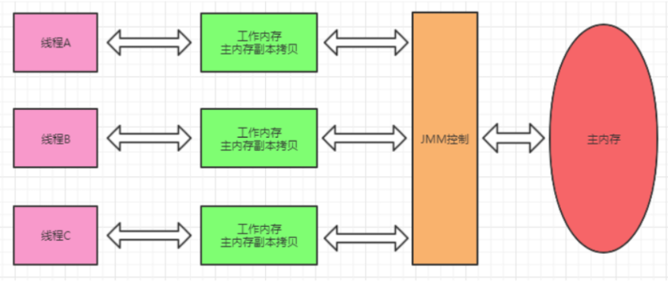

- Java 内存模型，与 #多线程 高度相关
- # 作用
- 屏蔽掉各种硬件和操作系统的内存访问差异，以实现让java程序在各种平台下都能达到一致的并发效果。
- # 结构
- 分为`主内存`和线程的`工作内存`，由JMM控制数据的传递。
- 所有的变量都存储到主内存中，包括实例变量，静态变量，但是不包括局部变量和方法参数。
  logseq.order-list-type:: number
- 每个线程都拥有独立的工作内存，保存了该线程用到的变量和主内存的副本拷贝，线程对变量的操作也在这一部分进行。
  logseq.order-list-type:: number
- 线程不能直接读写主内存的变量。
  logseq.order-list-type:: number
- 不同线程之间不能直接访问其他线程工作内存的变量，线程之间变量值的传递需要通过主内存来完成。
  logseq.order-list-type:: number
- 
- # 特性
- 整个 java 内存模型实际上是围绕着三个特征建立起来的。分别是：原子性，可见性，有序性。
- ## 原子性
- 原子性指的是一个操作是不可分割，不可中断的，一个线程在执行时不会被其他线程干扰。
- JMM 只能保证基本的原子性，如果要保证一个代码块的原子性，提供了 monitorenter 和 moniterexit 两个字节码指令，也就是 synchronized 关键字。**因此在 synchronized 块之间的操作都是原子性的。**
- ## 可见性
- 可见性指当一个线程修改共享变量的值，其他线程能够立即知道被修改了。volatile、synchronized、final 能够实现可见性
  id:: 64d20472-0d5b-4205-81f9-241362fad076
	- 1. 变量被 volatile 修饰时，这个变量被修改后会立刻刷新到主内存，当其它线程需要读取该变量时，会去主内存中读取新值。
	- 2. synchronized 的原理是，在执行完，进入unlock之前，必须将共享变量同步到主内存中。
	- 3. final修饰的字段，一旦初始化完成，如果没有对象逸出（指对象为初始化完成就可以被别的线程使用），那么对于其他线程都是可见的。
- ## 有序性
- 在 java 中，可以使用 synchronized 或者 volatile 保证多线程之间操作的有序性。
  id:: 64d20485-230f-4153-bba9-2a3b5f28ccda
	- 1. volatile 关键字是使用内存屏障达到禁止指令重排序，以保证有序性。
	- 2. synchronized 的原理是，一个线程 lock 之后，必须 unlock 后，其他线程才可以重新 lock，使得被 synchronized 包住的代码块在多线程之间是串行执行的。
- # 特性实现的关键字
- `volatile`保证可见性、有序性（即防止重排序）
- `synchronized`保证原子性、有序性、可见性
- `final`保证可见性
- id:: 64de305f-b42b-4b6b-bb84-d9af9cc790ca
  |特性|原子性|可见性|有序性|
  | ---        |    ----   |    --- | --- |
  |volatile  |否          |是      |是|
  |synchronized|是|是|是|
  |final       |否          |是      |否|