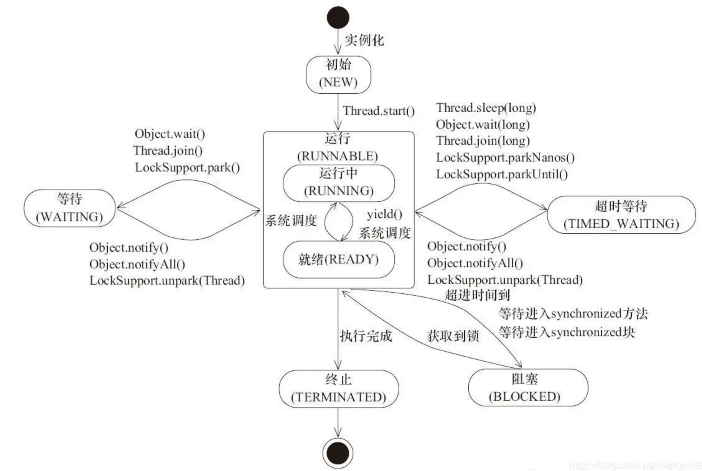

# 实现多线程的手段
	- 1. 继承 `Thread` 类
		- 重写 `run` 方法，调用时使用 `start` 方法。`start()`方法的调用后并不是立即执行多线程代码，而是使得该线程变为可运行态（Runnable），什么时候运行是由操作系统决定的。
	- 2. 实现 `Runnable` 接口
		- 在启动的多线程的时候，需要先通过Thread类的构造方法 Thread(Runnable target) 构造出对象，然后调用Thread对象的 start() 方法来运行多线程代码。
	- 实现 Runnable 接口比继承 Thread 类所具有的优势：
		- 适合多个相同的程序代码的线程去处理同一个资源
		- 可以避免java中的单继承的限制
		- 增加程序的健壮性，代码可以被多个线程共享，代码和数据独立
		- 线程池只能放入实现 Runable 或 Callable 类线程，不能直接放入继承 Thread 的类
- # 线程的状态
	- `New`：**新建状态**，当线程创建完成时为新建状态，即new Thread(...)，还没有调用start方法时，线程处于新建状态。
	- `Runnable`：**就绪状态**，当调用线程的的start方法后，线程进入就绪状态，等待CPU资源。处于就绪状态的线程由Java运行时系统的线程调度程序(thread scheduler)来调度。
	- `Running`：**运行状态**，就绪状态的线程获取到CPU执行权以后进入运行状态，开始执行run方法。
	- `Blocked`：**阻塞状态**，线程没有执行完，由于某种原因（如，I/O操作等）让出CPU执行权，自身进入阻塞状态。
		- **等待阻塞**：运行( running )的线程执行 o.wait ()方法， JVM 会把该线程放入等待队列( waiting queue )中。
		- **同步阻塞**：运行( running )的线程在获取对象的同步锁时，若该同步锁被别的线程占用，则 JVM 会把该线程放入锁池( lock pool )中。
		- **其他阻塞**：运行( running )的线程执行 Thread . sleep ( long ms )或 t . join ()方法，或者发出了 I / O 请求时， JVM 会把该线程置为阻塞状态。当 sleep ()状态超时、 join ()等待线程终止或者超时、或者 I / O 处理完毕时，线程重新转入可运行( runnable )状态。
	- `Dead`：**死亡状态**，线程执行完成或者执行过程中出现异常，线程就会进入死亡状态。
	- {:height 416, :width 558}
- # 传递数据与获取返回值
	- ## 传递数据
		- 1. 构造方法传入。在创建线程时，必须要建立一个Thread类的或其子类的实例。因此，我们不难想到在调用start方法之前通过线程类的构造方法将数据传入线程。并将传入的数据使用类变量保存起来，以便线程使用(其实就是在run方法中使用)。
		- 2. 通过变量和方法传递数据。通过 setXXX() 方法为对象赋值。
		- 3. 通过回调方法传递数据。
	- ## 获取返回值
		- 1. 主线程使用 while 循环等待，线程完成后数据返回到主线程
			- ```java
			  public static void main(String[] args) throws InterruptedException {
			        MyThreadReturn myThreadReturn = new MyThreadReturn();
			        Thread thread = new Thread(myThreadReturn);
			        thread.start();
			        /** 通过while循环判断*/
			        while (myThreadReturn.getReturnValue() == null){
			            Thread.sleep(1000);
			        }
			        System.out.println(myThreadReturn.getReturnValue());
			    }
			  ```
		- 2. 使用 join 方法等待子线程执行完毕。本质与通过循环判断是一样的。
			- ```java
			  public static void main(String[] args) throws InterruptedException {
			        MyThreadReturn myThreadReturn = new MyThreadReturn();
			        Thread thread = new Thread(myThreadReturn);
			        thread.start();
			        /** 使用join*/
			        thread.join();
			        System.out.println(myThreadReturn.getReturnValue());
			    }
			  ```
		- 3. 使用 `Callable` 接口和 `FutureTask`。在JDK1.5加入了Callable接口，实现该接口并重写call()方法也能创建新线程，并且该方法是有返回值的！
			- ```java
			  public class MyCallable implements Callable<String> {
			    @Override
			    public String call() throws Exception {
			        System.out.println("线程执行......");
			        Thread.sleep(5000);
			        System.out.println("线程执行完毕......");
			        return "hello world!!!";
			    }
			    public static void main(String[] args) throws ExecutionException, InterruptedException {
			        FutureTask<String> futureTask = new FutureTask<>(new MyCallable());
			        /***
			         * futureTask 实现了 Runnable接口
			         * 所以新建线程的时候可以传入futureTask
			         * FutureTask重写的run方法中实际是调用了Callable接口在call()方法
			         * 所以执行线程的时候回执行call方法的内容
			         */
			        Thread thread = new Thread(futureTask);
			        thread.start();
			        String value = futureTask.get();
			        System.out.println(value);
			    }
			  }
			  ```
		- 4. 使用线程池
			- ```java
			  public static void main(String[] args) throws ExecutionException, InterruptedException {
			      ExecutorService executorService = Executors.newCachedThreadPool();
			      Future<String> submit = executorService.submit(new MyCallable());
			      System.out.println(submit.get());
			  }
			  ```
- # 线程的调度
	- 1. 优先级。优先级用整数表示，1 ~ 10，
	- 2. 线程睡眠。`Thread.sleep(long millis)`方法，使线程转到阻塞状态。millis参数设定睡眠的时间，以毫秒为单位。当睡眠结束后，就转为就绪（Runnable）状态。sleep()平台移植性好。
	- 3. 线程等待。Object 类中的 `wait()` 方法，导致当前的线程等待，直到其他线程调用此对象的 `notify()` 方法或 `notifyAll()` 唤醒方法。这个两个唤醒方法也是Object类中的方法，行为等价于调用 wait(0) 一样。
	- 4. 线程让步。`Thread.yield()` 方法，暂停当前正在执行的线程对象，把执行机会让给相同或者更高优先级的线程。
	- 5. 线程加入。`join()` 方法，等待其他线程终止。在当前线程中调用另一个线程的 `join()` 方法，则当前线程转入阻塞状态，直到另一个进程运行结束，当前线程再由阻塞转为就绪状态。
	- 6. 线程唤醒。Object类中的 `notify()` 方法，唤醒在此对象监视器上等待的单个线程。如果所有线程都在此对象上等待，则会选择唤醒其中一个线程。选择是任意性的，并在对实现做出决定时发生。类似的方法还有一个 `notifyAll()` ，唤醒在此对象监视器上等待的所有线程。
- # 常用的方法
	- 1. `sleep(long millis)`：在指定的毫秒内让当前正在执行的线程休眠，进入**阻塞状态**
	- 2. `join()`：执行该方法的线程的调用者，要等待子线程运行完成后再结束运行
	- 3. `yield()`：将当前运行的线程回到**可执行状态**，并允许具有相同优先级的其他线程获得运行机会。但实际上无法保证能够达到让步的目的
	- > `sleep()`和`yield()`的区别：`sleep()`使当前线程进入停滞状态，所以执行`sleep()`的线程在指定的时间内肯定不会被执行；`yield()`只是使当前线程重新回到可执行状态，所以执行`yield()`的线程有可能在进入到可执行状态后马上又被执行。
	- > sleep 方法使当前运行中的线程睡眼一段时间，进入不可运行状态，这段时间的长短是由程序设定的，yield 方法使当前线程让出 CPU 占有权，但让出的时间是不可设定的。实际上，yield()方法对应了如下操作：先检测当前是否有相同优先级的线程处于同可运行状态，如有，则把 CPU  的占有权交给此线程，否则，继续运行原来的线程。所以yield()方法称为“退让”，它把运行机会让给了同等优先级的其他线程，sleep 方法允许较低优先级的线程获得运行机会，但 yield()  方法执行时，当前线程仍处在可运行状态，所以，不可能让出较低优先级的线程些时获得 CPU 占有权。在一个运行系统中，如果较高优先级的线程没有调用 sleep 方法，又没有受到 I\O 阻塞，那么，较低优先级线程只能等待所有较高优先级的线程运行结束，才有机会运行。
	- 4. `setPriority()`：设置线程的优先级。
	- 5. `interrupt()`：向线程发送终止信号，让线程在无限等待中（如死锁）抛出，从而结束掉线程，但是实际上只是将线程的状态置位，不会真正的终止线程。
	- > 当线程未被阻塞时，可以使用`Thread.currentThread().isInterrupted()` 来检查自己的中断状态，以此来进行逻辑判断；
	- > 但是当线程被阻塞的时候，比如被Object.wait, Thread.join和Thread.sleep三种方法之一阻塞时。调用它的 interrupt() 方法，由于没有占用 CPU，将无法修改中断状态，会抛出 `InterruptedException` 错误。当代码调用中须要抛出一个InterruptedException, 你可以选择把中断状态复位, 也可以选择向外抛出InterruptedException, 由外层的调用者来决定。
	- 6. `wait()`与`notify()`：这两个方法是属于 Object 类的，必须与 `synchronized(Obj)` 方法一起使用。也就是这两个方法的操作必须是获取到了对象的锁，从语法角度来说就是`Obj.wait()`，`Obj.notify()`必须在`synchronized(Obj){...}`语句块内。
	- > 从功能上来说wait就是说线程在获取对象锁后，主动释放对象锁，同时本线程休眠。直到有其它线程调用对象的notify()唤醒该线程，才能继续获取对象锁，并继续执行。
	- > 相应的notify()就是对对象锁的唤醒操作。但有一点需要注意的是notify()调用后，并不是马上就释放对象锁的，而是在相应的synchronized(){}语句块执行结束，自动释放锁后，JVM会在wait()对象锁的线程中随机选取一线程，赋予其对象锁，唤醒线程，继续执行。这样就提供了在线程间同步、唤醒的操作。
	- 7. `wait()` 与 `sleep()` 方法的区别
		- `Thread.sleep()` 与 `Object.wait()` 二者都可以暂停当前线程，释放CPU控制权，主要的区别在于**Object.wait()在释放CPU同时，释放了对象锁的控制。**
- 实例：[[三线程打印ABC]]