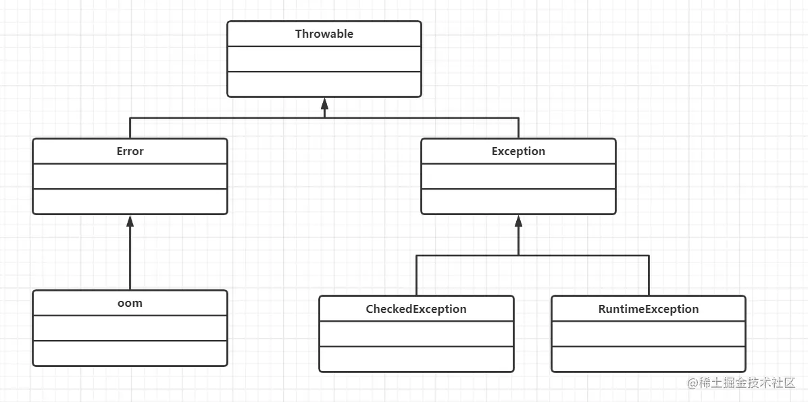

- **常见的异常：**
- `NullPointerException` 空指针异常
- `ArrayIndexOutOfBoundsException` 索引越界异常
- `InputFormatException` 输入类型不匹配
- `SQLException` SQL异常
- `IllegalArgumentException` 非法参数
- `NumberFormatException` 类型转换异常 等等....
- # 异常体系结构
- Java定义了一个`Throwable`类作为所有异常类的超类。
- 继承自他的有`Error`和`Exception`两个类型：
	- `Error`：Error类以及他的子类的实例，代表了JVM本身的错误。错误不能被程序员通过代码处理，Error很少出现。
	- `Exception`：是程序本身能够处理的异常，如空指针、下标越界、类型转换等。Exception是所有异常类的超类，其子类对应了各种可能出现的异常事件，通常可分为：
		- 运行时异常，`RuntimeException`：这类异常通常是由编程错误导致的，所以在编写程序时，**并不要求必须使用异常处理机制处理这类异常**，而是经常需要通过增加“逻辑处理来避免这些异常”，常见的运行时异常有：**数组下标越界、空指针、被0除**等。
		- 受检异常，`CheckedException`：所有不是`RuntimeException`类型的`Exception`，要求必须处理该类异常，否则代码编译不通过。常见的有：`IOException`等。
- 
	- # 处理异常的关键字
		- `try`：用于监听。try后紧跟一个花括号括起来的代码块（花括号不可省略），简称try块，它里面放置可能引发异常的代码，当try语句块内发生异常时，异常就被抛出。
		- `catch`: 用于捕获异常。catch后对应异常类型和一个代码块，用于处理try块发生对应类型的异常。
		- `throws`：用在方法签名中，用于声明该方法可能抛出的异常。
		- `throw`:用于抛出异常
		- `finally`:用于清理资源，**finally语句块总是会被执行**。 多个catch块后还可以跟一个finally块，finally块用于回收在try块里打开的物理资源（如数据库连接、网络连接和磁盘文件）。只有finally块执行完成之后，才会回来执行try或者catch块中的return或者throw语句，如果finally中使用了return或者throw等终止方法的语句，则就不会跳回执行，直接停止。