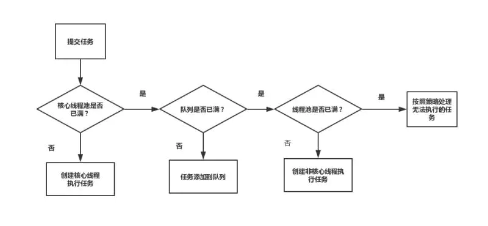

# 线程池的使用
	- 作用：管理线程，避免增加创建线程和销毁线程的资源损耗。提高响应速度。重复利用线程资源。
- # 创建
	- ```java
	  public ThreadPoolExecutor(int corePoolSize, //核心线程数
	    int maximumPoolSize, //最大线程数
	    long keepAliveTime, //非核心线程空闲的存活时间
	    TimeUnit unit, //上述时间的单位
	    BlockingQueue<Runnable> workQueue, //队列，核心线程池满了以后任务添加到队列中
	    ThreadFactory threadFactory, //创建线程的工厂类，可以用来设置名称
	    RejectedExecutionHandler handler) //线程池执行拒绝策略
	  ```
	- ## 如何设置合适的线程数
		- CPU 密集型，配置线程数量经验值是：`N+1`，N 代表 CPU 核心数。
		  logseq.order-list-type:: number
		- IO 密集型，通常设置为 `2N + 1`，或者`线程数 = N / (1 - 阻塞系数)`，阻塞系数为`0.8~0.9`。实际业务中基本上都是 IO 密集型。
		  logseq.order-list-type:: number
- # 提交过程
	- 
	- 提交一个任务，线程池里存活的核心线程数小于线程数 corePoolSize 时，线程池会创建一个核心线程去处理提交的任务。
	  logseq.order-list-type:: number
	- 如果线程池核心线程数已满，即线程数已经等于 corePoolSize，一个新提交的任务，会被放进任务队列 workQueue 排队等待执行。
	  logseq.order-list-type:: number
	- 当线程池里面存活的线程数已经等于 corePoolSize 了, 并且任务队列 workQueue 也满，判断线程数是否达到 maximumPoolSize，即最大线程数是否已满，如果没到达，创建一个非核心线程执行提交的任务。
	  logseq.order-list-type:: number
	- 如果当前的线程数达到了 maximumPoolSize，还有新的任务过来的话，直接采用拒绝策略处理。
	  logseq.order-list-type:: number
- # 状态
	- ## RUNNING
		- 该状态的线程池会接收新任务，并处理阻塞队列中的任务;
		- 调用线程池的 shutdown() 方法，可以切换到 SHUTDOWN 状态;
		- 调用线程池的 shutdownNow() 方法，可以切换到 STOP 状态;
	- ## SHUTDOWN
		- 该状态的线程池不会接收新任务，但会处理阻塞队列中的任务；
		- 队列为空，并且线程池中执行的任务也为空, 进入 TIDYING 状态;
	- ## STOP
		- 该状态的线程不会接收新任务，也不会处理阻塞队列中的任务，而且会中断正在运行的任务；
		- 线程池中执行的任务为空, 进入 TIDYING 状态;
	- ## TIDYING
		- 该状态表明所有的任务已经运行终止，记录的任务数量为 0。
		- terminated() 执行完毕，进入 TERMINATED 状态
	- ## TERMINATED
		- 该状态表示线程池彻底终止
- # 拒绝策略
	- 1. `AbortPolicy`：为线程池默认的拒绝策略，该策略直接抛异常处理。
	- 2. `DiscardPolicy`：直接抛弃不处理。
	- 3. `DiscardOldestPolicy`：丢弃队列中最老的任务。
	- 4. `CallerRunsPolicy`：将任务分配给当前执行 `execute` 方法线程来处理。
- # 队列
	- `ArrayBlockingQueue`（有界队列）是一个用数组实现的有界阻塞队列，按 FIFO 排序量。
	- `LinkedBlockingQueue`（可设置容量队列）基于链表结构的阻塞队列，按 FIFO 排序任务，容量可以选择进行设置，不设置的话，将是一个无边界的阻塞队列，最大长度为 Integer.MAX_VALUE，吞吐量通常要高于 ArrayBlockingQueue；**newFixedThreadPool 线程池使用了这个队列**
	- `DelayQueue`（延迟队列）是一个任务定时周期的延迟执行的队列。根据指定的执行时间从小到大排序，否则根据插入到队列的先后排序。newScheduledThreadPool 线程池使用了这个队列。
	- `PriorityBlockingQueue`（优先级队列）是具有优先级的无界阻塞队列；
	- `SynchronousQueue`（同步队列）一个不存储元素的阻塞队列，每个插入操作必须等到另一个线程调用移除操作，否则插入操作一直处于阻塞状态，吞吐量通常要高于 LinkedBlockingQuene，newCachedThreadPool 线程池使用了这个队列。
- # 内置的线程池
	- ## newFixedThreadPool
		- 核心线程数和最大线程数大小一致
		- 没有非空闲时间，即 keepAliveTime 为 0
		- 阻塞队列为无界队列 LinkedBlockingQueue，会导致 OOM
		- 适用于 CPU 密集型的任务，确保 CPU 在长期被工作线程使用的情况下，尽可能的少的分配线程，即适用执行长期的任务。
	- ## newCachedThreadPool
		- 核心线程数为 0
		- 最大线程数为 Integer.MAX_VALUE
		- 阻塞队列是 SynchronousQueue
		- 非核心线程空闲存活时间为 60 秒
		- 此种线程池线程缓存60秒不被销毁，**可用于处理需要频繁创建线程的场景**。用于并发执行大量短期的小任务。
	- ## newSingleThreadExecutor
		- 核心线程数为 1
		- 最大线程数也为 1
		- 阻塞队列是 LinkedBlockingQueue
		- keepAliveTime 为 0
		- 适用于串行执行任务的场景，一个任务一个任务地执行。（顺序是按照提交的顺序执行的）
	- ## newScheduledThreadPool
		- 最大线程数为 Integer.MAX_VALUE
		- 阻塞队列是 DelayedWorkQueue
		- keepAliveTime 为 0
		- scheduleAtFixedRate() ：按某种速率周期执行
		- scheduleWithFixedDelay()：在某个延迟后执行
		- 周期性执行任务的场景，需要限制线程数量的场景
	- ## ForkJoinPool
		- Java7 提供了 ForkJoinPool，其核心思想将一个任务拆分为多个小任务并行计算，再将多个小任务的结果合并为总的计算结果，即 MapReduce 思想。
		- 它同 ThreadPoolExecutor 一样，也实现了 Executor 和 ExecutorService 接口。它使用了一个**无限队列**来保存需要执行的任务，而线程的数量则是通过构造函数传入，如果没有向构造函数中传入希望的线程数量，那么**当前计算机可用的 CPU 数量**会被设置为线程数量作为默认值。