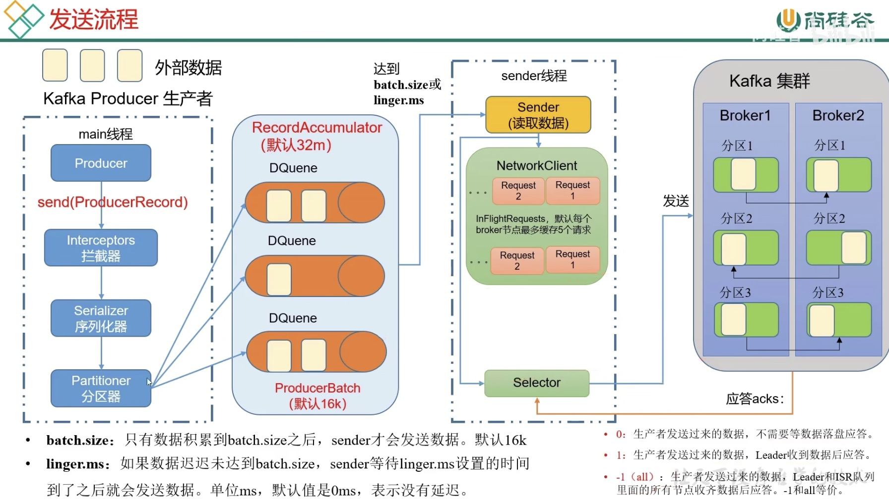

- #分布式
- #中间件
- Kafka是一个分布式的基于发布/订阅模式的消息队列，主要用于大数据实时处理领域。
	- 发布/订阅：消息的发送者不会将消息直接发送给特定的订阅者，而是将消息分为不同的类别，订阅着只接收感兴趣的消息。
- 最新定义：Kafka是一个开源的分布式事件流平台。用于h高性能数据管道、流分析、数据集成和关键任务应用。
- # 基础架构
- 生产者 <-> broker <-> 消费者
- 为了方便扩展，并提高吞吐量，一个`topic`可以分为多个`partition`。
- 配合分区的设计，提出消费者组的概念，组内每个消费者并行消费。
- 为了提高可用性，为每个partition增加若干副本。
- 使用`ZooKeeper`存储架构分区信息，如Leader信息，2.8之后可以不采用ZK。
- 
- # 生产者
- 发送消息过程：
	- main线程创建`Producer`
	- 调用`send`方法
	- 进入拦截器`Interceptor`
	- 进入序列化器`Serializer`，序列化数据
	- 进入分区器`Partitioner`，确定发送到的分区
	- 发送数据到缓存队列中`RecordAccumulator`，默认大小为32MB
	- `sender`线程拉取数据，拉取的时机为队列中的数据累积到`batch.size`（默认16KB）之后；或者等待了`linger.ms`（默认为0ms）之后
	- `sender`线程发送数据，每个发送队列最多可以缓存五个请求
	- 使用`selector`发送数据，并获取应答情况，清理数据或重试
- {:height 406, :width 708}
- ## 分区的好处
	- 合理使用资源。可以将海量的数据按照分区切割成不同的块，存储在堕胎`Broker`上，实现负载均衡的效果。
	  logseq.order-list-type:: number
	- 提高并行度。生产者可以以分区为单位发送数据，消费者可以以分区为单位消费数据。
	  logseq.order-list-type:: number
- ## 生产者分区策略
	- 指定分区`partition`值，直接将指定的分区值作为目标分区。
	  logseq.order-list-type:: number
	- 没有指定`partition`值，但有`key`的情况下，将`key`的`hash`值与topic的`partition`数进行**取余**得到`partition`值。
	  logseq.order-list-type:: number
	- 即没有`partition`值，又没有`key`的情况下，将采取黏性分区器`Sticky Partition`，会随机选取一个分区，并尽可能使用该分区，直到该分区`batch`已满或者已完成，再随机选一个与上次不同的分区使用。
	  logseq.order-list-type:: number
- 可以自定义分区器，来根据实际情况分发数据。如过滤掉无效数据等。
- ### 提高吞吐量
- 缓存队列的数据发送到broker，可以通过以下手段提高吞吐量
	- 配合调整`batch.size`和`linger.ms`，但要注意数据延迟
	  logseq.order-list-type:: number
	- `compression.type`压缩snappy
	  logseq.order-list-type:: number
	- 修改`RecordAccumulator`缓冲区大小，如修改为64MB
	  logseq.order-list-type:: number
- ### 提高数据可靠性
- 可靠性分析：集群应答`selector``acks`的类型：
	- `0`：生产者发送过来的数据，不需要等数据落盘应答。
		- 缺点：容易发生丢失数据，实际也不会使用。
		- 可靠性差，效率高。
	- `1`：生产者发送过来的数据，`Leader`收到数据后应答。
		- 缺点：应答完成后，还没开始同步数据副本，`Leader`挂掉。新的`Leader`不会再收到数据，因为生产者认为已经发送成功了。数据丢失。
		- 可靠性中等，效率中等。
		- 一般用于允许丢失个别数据的情况，如传输普通日志
	- `-1(all)`：生产者发送过来的数据，`Leader`和`ISR`队列里面的所有节点收起数据后应答。
		- > 如果某个Follower长时间没有应答Leader，Leader会将该节点从维护的ISR队列中删除。该时间阈值由`replica.lag.time.max.ms`参数设定。
		- 可靠性高，效率低。
		- 可能会出现Leader没有及时返回ack就挂掉，导致生产者重复发送数据的情况。
		- 用于传输重要数据。
- 数据完全可靠的条件
  id:: 64ca2a65-a917-4f46-aad2-254dbd2eda70
	- ACL级别设置为-1
	  logseq.order-list-type:: number
	- 分区副本大于等于2
	  logseq.order-list-type:: number
	- ISR里应答的最小副本数量大于等于2
	  logseq.order-list-type:: number
- ### 数据重复问题
- **至少一次**：上述完全可靠条件 ((64ca2a65-a917-4f46-aad2-254dbd2eda70))，数据至少发送一次。可以保证数据不丢失，但不能保证数据不重复。
- **最多一次**：当`ack`为0时，数据最多发一次。可以保证数据不重复，但是不能保证数据不丢失。
- **精确一次**：但是某些重要数据，要求保证数据既不能重复也不能丢失。
	- 解决方式：`精确一次 =  幂等性 + 至少一次`
		- 幂等性：`Producer`不论向Broker发送多少次重复数据，Broker只会持久化一条，保证了不重复。实现方式为：`<PID, Partition, SeqNumber>`相同主键的消息提交时，`Broker`只会持久化一条。`PID`(Producer ID)是Kafka每次重启会分配一个新的；`Partition`表示分区号；`Sequence Number`是单调自增的。**可以看出幂等性只能保证在单个分区单个会话内不重复**。
		- 事务：[[Kafka 事务]]，可以保证在全局具有唯一性。
			- [继续学习](https://www.bilibili.com/video/BV1vr4y1677k?p=20)
-
-