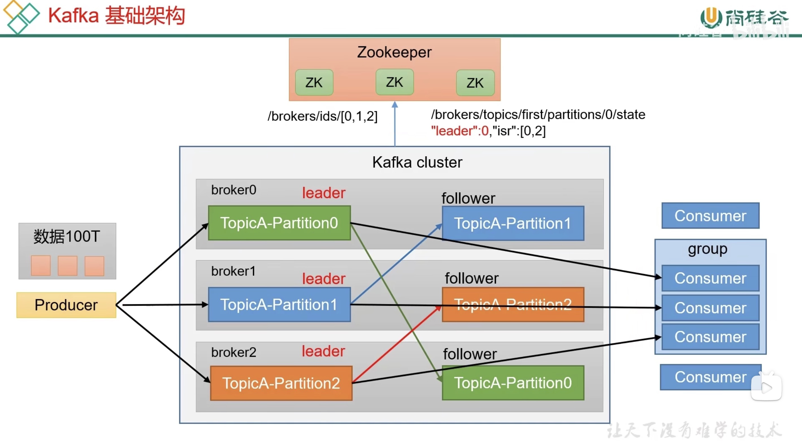

- #分布式
- #消息队列
- Kafka是一个分布式的基于发布/订阅模式的消息队列，主要用于大数据实时处理领域。
	- 发布/订阅：消息的发送者不会将消息直接发送给特定的订阅者，而是将消息分为不同的类别，订阅着只接收感兴趣的消息。
- 最新定义：Kafka是一个开源的分布式事件流平台。用于h高性能数据管道、流分析、数据集成和关键任务应用。
- # 基础架构
- 生产者 <-> topic <-> 消费者
- 为了方便扩展，并提高吞吐量，一个`topic`可以分为多个`partition`。
- 配合分区的设计，提出消费者组的概念，组内每个消费者并行消费。
- 为了提高可用性，为每个partition增加若干副本。
- 使用`ZooKeeper`存储架构分区信息，如Leader信息，2.8之后可以不采用ZK。
- 
- [继续学习](https://www.bilibili.com/video/BV1vr4y1677k?p=10)