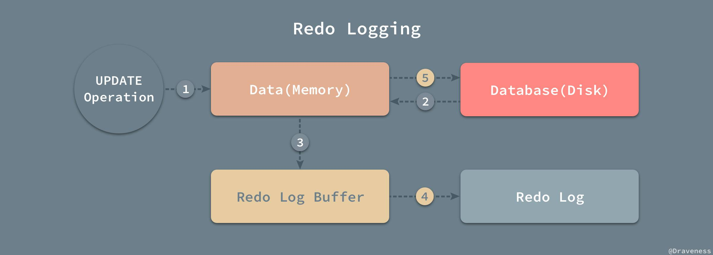

- 事务具有四个基本属性ACID，分别是：原子性（Atomicity）、一致性（Consistent）、隔离性（Isolation）和持久性（Durability）。
- # 原子性
	- 原子性是指一个事务是一个不可分割的工作单位，其中的操作要么都做，要么都不做；如果事务中一个sql语句执行失败，则已执行的语句也必须回滚。即事务不可分割、不可约简。
	- 实现原子性的关键在于，事务回滚时能够撤销已经执行的sql语句。MySQL中实现事务回滚，依赖的是`undo log` ：
		- > undo log属于逻辑日志，它记录的是sql执行相关的信息。
		  > 当发生回滚时，`InnoDB`会根据undo log的内容做与之前相反的工作：
		  > 对于每个insert，回滚时会执行delete；
		  > 对于每个delete，回滚时会执行insert；
		  > 对于每个update，回滚时会执行一个相反的update，把数据改回去。
- # 持久性
	- 持久性是指，事务一旦提交，其所做的修改会永久保存到数据库中，此时即使系统崩溃修改的数据也不会丢失。
	- MySQL中实现持久性，依赖的是`redo log`。当尝试修改一条数据时：
		- 1. 先将数据从磁盘读入内存中缓存，并更新缓存中的数据
		- 2. 生成一条redo log写入日志缓存`redo log buffer`
		- 3. 事务提交时，先将日志缓存中的内容刷写到磁盘日志中，再将内存中的数据更新到磁盘中
		  > 日志缓存除了在事务提交时刷写到磁盘中，也会有线程在后台每隔一秒钟刷写一次。
		  > 这种**先写日志，再写磁盘**的技术就是经常说到的`WAL(Write-Ahead Logging)` 技术。
		  
		- 当错误发生后，数据库重启时，会从red log 中找出未被更到磁盘中的日志，重新执行以满足事务的持久性。
- # 隔离性
	- 隔离性是指，事务内部的操作与其他事务是隔离的，并发执行的各个事务之间不能互相干扰。
	  原子性和持久性侧重于单个事务本身的问题，隔离性关注的则是不同事务之间的相互影响。
	- ## 事务隔离级别
		- 读未提交（RAED UNCOMMITTED），事务中的修改，即使未提交，对其他事务也是可见的。会导致脏读。
		- 读已提交（READ COMMITTED），事务只能读取其他事务已经提交了的数据。可以避免脏读，但会导致不可重复读。
		- 可重复读（REPEATABLE READ）保证在同一个事务中多次读取同样数据的结果是一致的。可以避免不可重复读，但会导致幻读（其他事务插入了数据）。
		- 串行化（SERIALIZABLE），所有读写操作都是顺序执行的，效率较低。
	- ## 并发一致性问题
		- 脏读（Dirty Read）：当前事务读取到了其他事务未提交的数据。
		- 不可重复读（Non-Repeatable Read）：一个事务先后两次读取同一条数据结果不一致。
		  > 脏读与不可重复读的区别在于：前者读到的是其他事务未提交的数据，后者读到的是其他事务已提交的数据。
		- 幻读（Phantom Read）：一个事务先后两次查询数据库得到的结果条数不一致。
		   > 不可重复读与幻读的区别可以通俗的理解为：前者是数据变了，后者是数据的行数变了。
	- ## 隔离的实现
	- 数据库对于隔离级别的实现就是使用**并发控制机制**对在同一时间执行的事务进行控制，限制不同的事务对于同一资源的访问和更新。常见的三种并发控制机制：
		- 锁。对要访问的数据项，添加锁。分为读锁（共享锁）和写锁（排他锁）。
		- 时间戳。乐观锁的一种实现
		  > 使用时间戳实现事务的隔离性时，往往都会使用乐观锁，先对数据进行修改，在写回时再去判断当前值，也就是时间戳是否改变过，如果没有改变过，就写入，否则，生成一个新的时间戳并再次更新数据，
		- 多版本和快照隔离。通过维护多个版本的数据，数据库可以允许事务在数据被其他事务更新时对旧版本的数据进行读取，很多数据库都对这一机制进行了实现；因为所有的读操作不再需要等待写锁的释放，所以能够显著地提升读的性能
	- ## 多版本并发控制
		- **MySQL中实现可重复读的事务隔离级别，依赖的是MVCC（Multi-Version Concurrency Control），同时又使用解决了幻读问题。**
		- [[MySQL 多版本并发控制]]
		- `InnoDB`实现MVCC，多个版本的数据可以共存，主要是依靠数据的**隐藏列**(也可以称之为标记位)和**undo log**。
		  其中数据的隐藏列包括了该行数据的版本号、删除时间、指向undo log的指针等等；
		  当读取数据时，MySQL可以通过隐藏列判断是否需要回滚，并找到回滚需要的undo log，从而实现MVCC。
- # 一致性
	- 一致性是指事务执行结束后，数据库的完整性约束没有被破坏，事务执行的前后都是合法的数据状态。
	  一致性是事务追求的最终目标：前面提到的原子性、持久性和隔离性，都是为了保证数据库状态的一致性。此外，除了数据库层面的保障，一致性的实现也需要应用层面进行保障。实现一致性的措施包括：
		- 保证原子性、持久性和隔离性，如果这些特性无法保证，事务的一致性也无法保证
		- 数据库本身提供保障，例如不允许向整形列插入字符串值、字符串长度不能超过列的限制等
		- 应用层面进行保障，例如如果转账操作只扣除转账者的余额，而没有增加接收者的余额，无论数据库实现的多么完美，也无法保证状态的一致
- 参考：
	- [https://draveness.me/mysql-transaction/](https://draveness.me/mysql-transaction/)
	- [https://segmentfault.com/a/1190000039139809](https://segmentfault.com/a/1190000039139809)