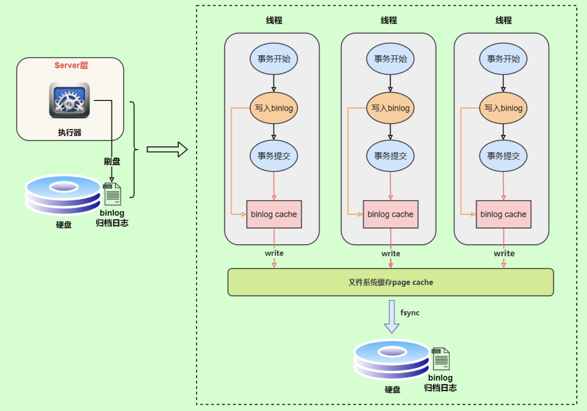
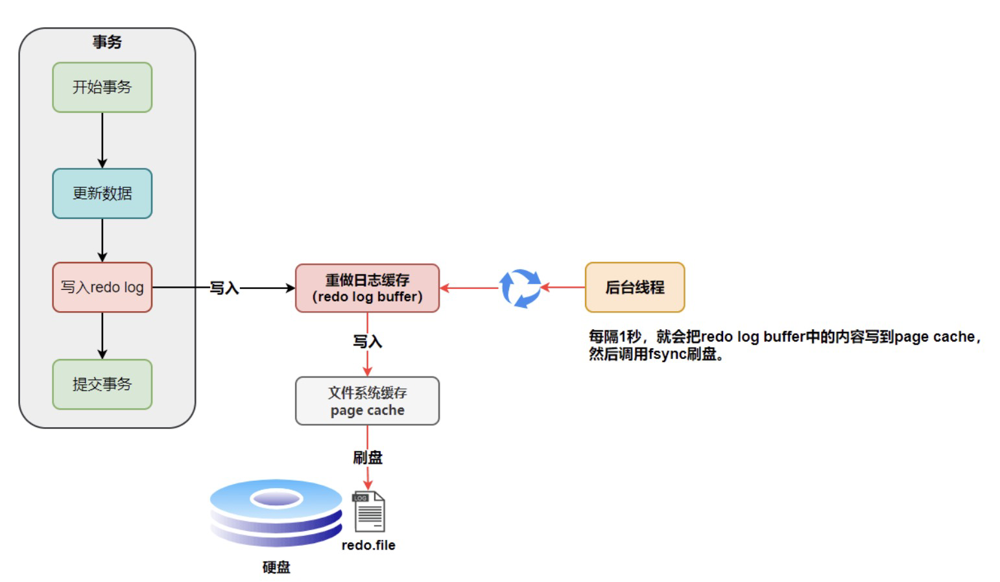
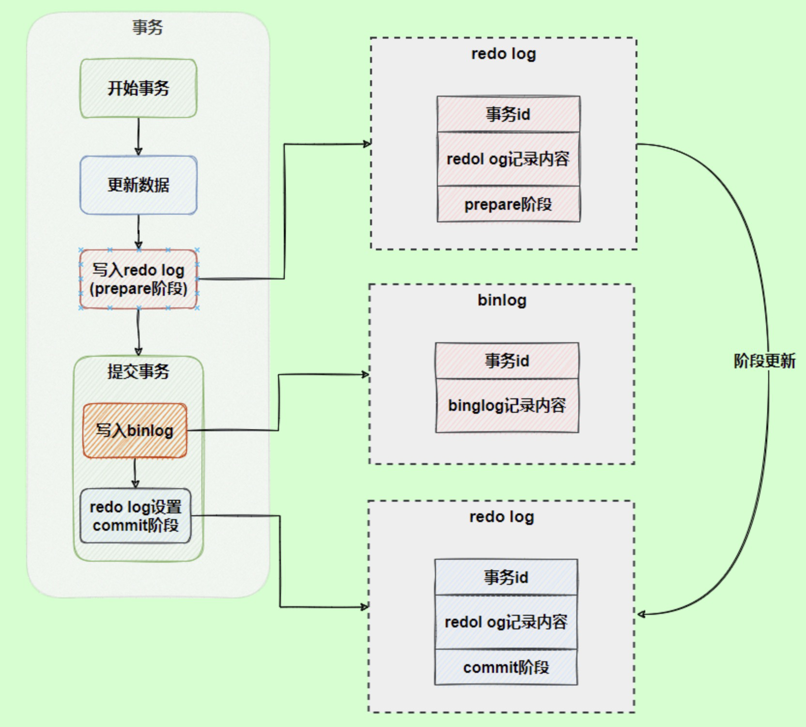

- 重点关注二进制日志（`binlog`）和事务日志（`redo log`、`undo log`）。
- > 逻辑日志：sql语句日志
  > 物理日志：数据页的变更日志
- # binlog
- 用于记录数据库执行的写入行操作信息，以二进制形式保存在磁盘中。
- binlog是由Server层实现的逻辑日志，任何存储引擎都会记录binlog日志。
- 可以用来数据库备份、主从同步、数据恢复等等。
- ## 写入机制
- 事务执行过程中，先把日志写入到`binlog cache`中，事务提交时，再把binlog cache 写到binlog文件中。
- binlog cache并不是直接写入到binlog文件中，而是先写入到文件系统的`page cache`中，再定时刷写到磁盘中。（时机可以配置：每次事务提交后；N次失误提交后）
- {:height 467, :width 643}
- # redo log
- `redo log`是`InnoDB`存储引擎独有的，给予了MySQL崩溃恢复的能力，**保证了数据的持久性和完整性**。
- `redo log`包括两部分：一个是内存中的日志缓冲(`redo log buffer`)，另一个是磁盘上的日志文件(`redo log file`)。`mysql`每执行一条`DML`语句，先将记录写入`redo log buffer`，后续某个时间点再一次性将多个操作记录写到`redo log file`。这种**先写日志，再写磁盘**的技术就是`MySQL`里经常说到的`WAL(Write-Ahead Logging)` 技术。
- `redo log buffer`刷写道磁盘的时机默认为：每次事务提交时都将进行刷盘操作。但是也有后台线程每隔一秒将其刷入到磁盘中。
  id:: 64d49161-e6b5-4e40-b559-89e53346e685
- 
- ## 记录形式
- redo log在磁盘中是以小组的形式存在的，整个文件小组大小固定，循环写入，当写入到结尾的时候，会回到开头循环写日志。
	- `write pos`表示`redo log`当前记录的`LSN`(逻辑序列号)位置
	- `check point`表示**数据页更改记录**刷盘后对应`redo log`所处的`LSN`(逻辑序列号)位置。
	- `write pos` -> `check point` 之间为空白部分，用于记录新的记录。
	- `check point` -> `write pos` 之间为等待进行实际数据页更改的记录。
	- 当`write pos`追上`check point`时，会先推动`check point`向前移动（将数据更改落盘），空出位置再记录新的日志。
	- MySQL宕机重启后，如果数据页`LSN`落后于`check point`，则从`check point`恢复即可。
- {:height 615, :width 712}
- # 两段式提交
- binlog 和 redo log，都提供了持久化保证，但是侧重点不一样，时机不一样：
	- `binlog`是在事务提交后才写入磁盘的。
	- `redo log`在事务执行过程中可以不断写入。
- 为了保证两者数据一致性，又引入了两段式提交：
	- 将`redo log`的写入拆分为两个步骤：`prepare`和`commit`。
- 作用过程：
	- 使用**两阶段提交**后，写入`binlog`时发生异常也不会有影响，因为`MySQL`根据`redo log`日志恢复数据时，发现`redo log`还处于`prepare`阶段，并且没有对应`binlog`日志，就会回滚该事务。
- 
- # undo log
- 记录事务的修改操作，用于在异常发生时，对已经执行但未提交的事务进行回滚。**保证了数据库事务的原子性**。
- 另外`MVCC`也依赖于 undo log来实现版本控制。