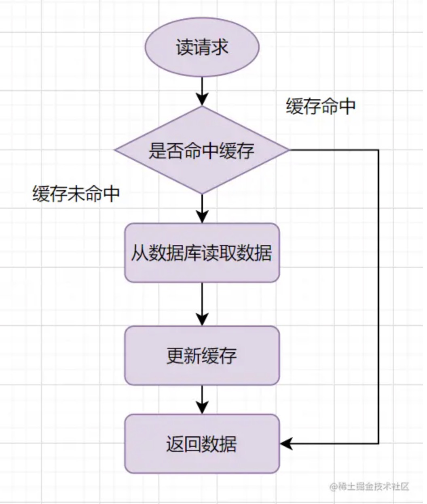
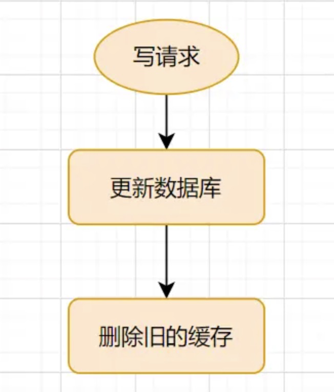
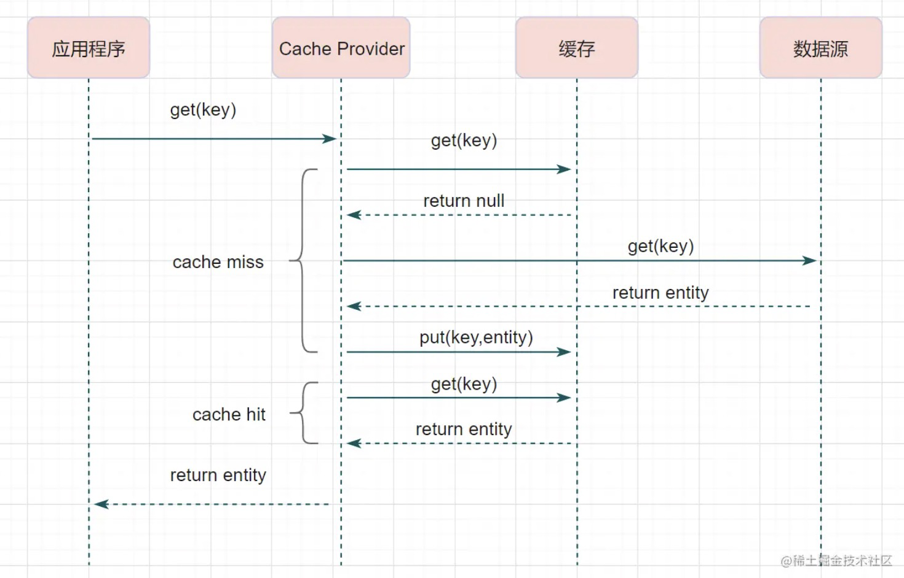
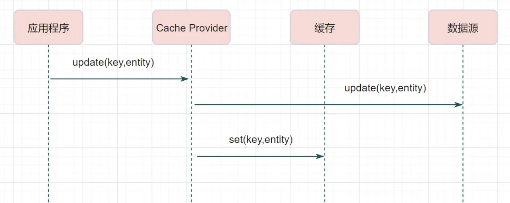
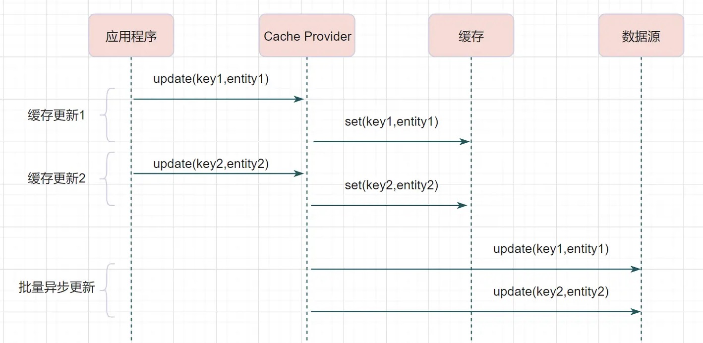

- #MySQL #Redis #分布式
- Redis 缓存可以提升性能、缓解数据库压力，但是使用缓存也会导致数据**不一致性**的问题。
- 一致性就是数据保持一致，在分布式系统中，可以理解为多个节点中数据的值是一致的。
- # 一致性
- **强一致性**：这种一致性级别是最符合用户直觉的，它要求系统写入什么，读出来的也会是什么，用户体验好，但实现起来往往对系统的性能影响大
- **弱一致性**：这种一致性级别约束了系统在写入成功后，不承诺立即可以读到写入的值，也不承诺多久之后数据能够达到一致，但会尽可能地保证到某个时间级别（比如秒级别）后，数据能够达到一致状态
- **最终一致性**：最终一致性是弱一致性的一个特例，系统会保证在一定时间内，能够达到一个数据一致的状态。这里之所以将最终一致性单独提出来，是因为它是弱一致性中非常推崇的一种一致性模型，也是业界在大型分布式系统的数据一致性上比较推崇的模型
- # 三个经典缓存模式
- ## 旁路缓存 Cache-Aside Pattern
- **旁路缓存模式**，读取缓存、读取数据库和更新缓存的操作，**都是由应用系统来完成**，是最常用的缓存策略。
- 缺点是可能会导致数据库与缓存不一致。
- **读流程**：
	- 当应用程序需要从数据库读取数据，先检查缓存数据是否命中。如果命中数据，则直接返回。
	  logseq.order-list-type:: number
	- 如果未命中缓存，则从数据库读取数据，同时将缓存写入到数据库中。
	  logseq.order-list-type:: number
- {:height 597, :width 302}
- **写流程**：
	- 写数据到数据库
	  logseq.order-list-type:: number
	- 将缓存中的数据失效或者更新缓存数据。（当更新缓存成本很高时，可以直接删除缓存）
	  logseq.order-list-type:: number
- {:height 207, :width 193}
- # 读写穿透 Read-Through/Write-Through
- **读/写穿透模式**，服务端把缓存作为主要数据存储。应用程序跟数据库缓存交互，都是通过`cache provider`**抽象缓存层**完成的。
- 可以理解为在旁路模式的基础上，在应用系统和缓存模块之间添加了一层缓存抽象层，专门用来读取和写入缓存。
- 优点是会让代码变得简洁，减少了数据库的负载，缺点是不经常请求的数据也会进入缓存，缓存会更大。
- **读流程：**
	- 从缓存读取数据，读到直接返回。
	  logseq.order-list-type:: number
	- 未读取到的话，从数据库加载，写入缓存，再返回响应。
	  logseq.order-list-type:: number
- {:height 472, :width 530}
- **写流程：**
	- 数据先写到缓存中。
	  logseq.order-list-type:: number
	- 再由缓存组件将数据写入数据。
	  logseq.order-list-type:: number
- {:height 233, :width 543}
- ## 异步缓存写入
- **Write behind**，与读写穿透类似，都是由`Cache Provider`来负责缓存和数据库的读写。
- 它两又有个很大的不同：
	- `Read/Write Through`是**同步更新**缓存和数据的
	- `Write Behind`则是只更新缓存，不直接更新数据库，通过**批量异步**的方式来更新数据库。
- 这种方式下，缓存和数据库的一致性不强，**对一致性要求高的系统要谨慎使用**。但是它适合频繁写的场景，MySQL的**InnoDB Buffer Pool机制**就使用到这种模式。
- > ((64d49161-e6b5-4e40-b559-89e53346e685))
- {:height 168, :width 564}
-
- # 旁路缓存下的一致性问题分析
- https://segmentfault.com/a/1190000041998615
- 最优写方案为：**先更新数据库，再删除缓存**
- 一致性解决方案：
- **缓存延时双删**：如果采取先删除缓存再更新数据的方案，以保证读请求的脏数据也被删除掉。
  logseq.order-list-type:: number
	- 先删除缓存
	  logseq.order-list-type:: number
	- 写数据库
	  logseq.order-list-type:: number
	- 休眠500毫秒，再删除缓存
	  logseq.order-list-type:: number
	- **延迟时间的目的就是确保读请求结束，写请求可以删除读请求造成的缓存脏数据。**
- **删除缓存重试机制**：为了避免缓存缓存删除失败，可以加入重试机制，再高并发场景下最好使用异步方式。
  logseq.order-list-type:: number
- **读取`binlog`异步删除**。对数据库的更新操作都会记录在binlog中，可以通过订阅binlog修改来更新删除缓存。
  logseq.order-list-type:: number
	- 更新数据库；
	  logseq.order-list-type:: number
	- 数据库会把操作信息记录在 binlog 日志中；
	  logseq.order-list-type:: number
	- 使用 canal 订阅 binlog 日志获取目标数据和 key；
	  logseq.order-list-type:: number
	- 缓存删除系统获取 canal 的数据，解析目标 key，尝试删除缓存。
	  logseq.order-list-type:: number
	- 如果删除失败则将消息发送到消息队列；
	  logseq.order-list-type:: number
	- 缓存删除系统重新从消息队列获取数据，再次执行删除操作。
	  logseq.order-list-type:: number