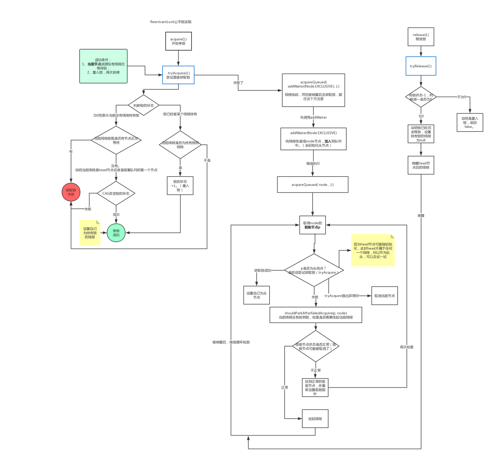

- `ReentrantLock` 是基于AQS（`AbstractQueuedSynchronizer`）实现的可重入锁，可以显示地指定为公平锁或非公平锁。
- 与 [[synchronized 锁]]的区别：
- |     | **ReentrantLock** | **Synchronized**     |
  | :---        |    :----:   |          ---: |
  | 锁实现机制 |依赖AQS | 监视器模式|
  | 灵活性 | 支持响应中断、超时、尝试获取锁 | 不灵活 |
  | 释放形式 | 必须显示调用 unlock() 释放锁 | 自动释放监视器 |
  | 锁类型 | 公平锁&非公平锁 | 非公平锁 |
  | 条件队列 | 可关联多个条件队列 | 关联一个条件队列 |
  | 可重入性 | 可重入 | 可重入 |
- ## 获取公平锁
	- 1. 尝试获取锁 `tryAcquire(arg)`。首先查看 AQS 的  `state` 是否为0
		- a. 为 0 则表示没有其他线程获得了锁，当前线程尝试获取。在尝试获取之前，使用 `hasQueuedPredecessors()` 方法来**判断 AQS 的队列中中是否有其他线程**，如果有则不会尝试获取锁，如果没有则获取锁。
		- b. 如果 state 大于 0，说明锁已经被获取了，则需要判断获取锁的线程是否为当前线程，是则需要将 `state + 1`，并将值更新。
	- 2. 写入队列。如果 `tryAcquire(arg)` 获取锁失败，则需要用 `addWaiter(Node.EXCLUSIVE)` 将当前线程写入队列中。
	- 3. 挂起等待线程。写入队列之后需要将当前线程挂起(利用`acquireQueued(addWaiter(Node.EXCLUSIVE), arg)`)。
	- 4. 如果处于排队等候机制中的线程一直无法获取锁，线程所在节点的状态会变成取消状态，取消状态的节点会从队列中释放。
	- ```java
	  public void lock() {
	    sync.lock();
	  }
	  final void lock() {
	       acquire(1);
	  }
	  //AbstractQueuedSynchronizer 中的 acquire()
	  public final void acquire(int arg) {
	    if (!tryAcquire(arg) &&
	        acquireQueued(addWaiter(Node.EXCLUSIVE), arg))
	      selfInterrupt();
	  }
	  // 尝试获取锁
	  protected final boolean tryAcquire(int acquires) {
	    final Thread current = Thread.currentThread();
	    int c = getState();
	    if (c == 0) {
	      if (!hasQueuedPredecessors() &&
	          compareAndSetState(0, acquires)) {
	        setExclusiveOwnerThread(current);
	        return true;
	      }
	    }
	    else if (current == getExclusiveOwnerThread()) {
	      int nextc = c + acquires;
	      if (nextc < 0)
	        throw new Error("Maximum lock count exceeded");
	      setState(nextc);
	      return true;
	    }
	    return false;
	  }
	  // 写入队列
	  private Node addWaiter(Node mode) {
	    Node node = new Node(Thread.currentThread(), mode);
	    // Try the fast path of enq; backup to full enq on failure
	    Node pred = tail;
	    if (pred != null) {
	        node.prev = pred;
	        if (compareAndSetTail(pred, node)) {
	            pred.next = node;
	            return node;
	        }
	    }
	    //通过自旋操作把当前节点加入到队列中
	    enq(node); 
	    return node;
	  }
	  ```
- ## 非公平锁获取锁
	- 1. 直接通过CAS操作尝试获取锁，失败后再调用 `tryAcquire` 尝试获取锁
	- 2. 在尝试获取锁时 `tryAcquire(arg)`，非公平锁是不需要判断队列中是否还有其他线程，也是直接尝试获取锁
	- ```java
	  final void lock() {
	    //直接尝试获取锁
	    if (compareAndSetState(0, 1))
	        setExclusiveOwnerThread(Thread.currentThread());
	    else
	        acquire(1);
	  }
	  final boolean nonfairTryAcquire(int acquires) {
	    final Thread current = Thread.currentThread();
	    int c = getState();
	    if (c == 0) {
	        //没有 !hasQueuedPredecessors() 判断
	        if (compareAndSetState(0, acquires)) {
	            setExclusiveOwnerThread(current);
	            return true;
	        }
	    }
	    else if (current == getExclusiveOwnerThread()) {
	        int nextc = c + acquires;
	        if (nextc < 0) // overflow
	            throw new Error("Maximum lock count exceeded");
	        setState(nextc);
	        return true;
	    }
	    return false;
	  }
	  ```
- # 释放锁
	- 首先会判断当前线程是否为获得锁的线程，由于是重入锁所以需要将 `state` 减到 0 才认为完全释放锁。
	- 释放之后需要调用 `unparkSuccessor(h)` 来唤醒被挂起的线程。
- # 区别
	- 由于公平锁需要关心队列的情况，得按照队列里的先后顺序来获取锁(会造成大量的线程上下文切换)，而非公平锁则没有这个限制。
	- 所以也就能解释非公平锁的效率会被公平锁更高。
	  
- 参考： https://it-blog-cn.com/blogs/parallel/reentrant_lock.html