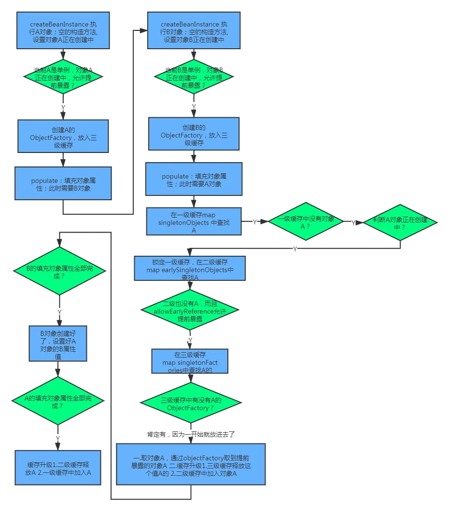

## Spring Bean 的作用域
	- `singleton` : 唯一 bean 实例，Spring 中的 bean 默认都是单例的。
	- `prototype` : 每次请求都会创建一个新的 bean 实例。
	- `request` : 每一次 HTTP 请求都会产生一个新的 bean，该 bean 仅在当前 HTTP request 内有效。
	- `session` : 每一次 HTTP 请求都会产生一个新的 bean，该 bean 仅在当前 HTTP session 内有效。
	- `global-session`： 全局 session 作用域，仅仅在基于 Portlet 的 web 应用中才有意义，Spring5 已经没有了。Portlet 是能够生成语义代码（例如：HTML）片段的小型 Java Web 插件。它们基于 portlet 容器，可以像 servlet 一样处理 HTTP 请求。但是，与 servlet 不同，每个 portlet 都有不同的会话。
- ## Spring Bean 实例化过程
	- Spring 创建 Bean 的过程分为三个步骤：
		- 1. 实例化 Instantiation
			- 简单理解为 new 了一个对象，对应方法：`AbstractAutowireCapableBeanFactory`中的`createBeanInstance` 方法
		- 2. 属性赋值 Populate
			- 为实例化出来的对象填充属性，对应方法为：`AbstractAutowireCapableBeanFactory`的`populateBean`方法。
			- 该步骤也是主要发生循环依赖的地方。基于构造方法的注入，第一步和第二步是同时进行的，出现循环依赖会直接报错。
		- 3. 初始化 Initialization
			- 初始化方法，完成 AOP 代理，对应方法为：`AbstractAutowireCapableBeanFactory`的`initializeBean` 方法，用`BeanPostProcessor`后置处理器来完成 AOP 的实现。
- ## 三级缓存
	- Spring 创建单例实例的过程中，会将相关过程中生成的实例存储在三个等级的缓存中：
		- 一级缓存，单例池：存放已经创建好的实例
			- `private final Map<String, Object> singletonObjects = new ConcurrentHashMap<>(256);`
		- 二级缓存，早期曝光对象：存放半成品 Bean，已创建对象，但未注入属性和初始化。
			- `private final Map<String, Object> earlySingletonObjects = new HashMap<>(16);`
		- 三级缓存，早期曝光对象工厂：存放 Bean 工厂对象，用来生成半成品的 Bean 并放入到二级缓存中，如果存在 AOP 存放的是 AOP 代理
		- `private final Map<String, ObjectFactory<?>> singletonFactories = new HashMap<>(16);`
	- 获取实例时，从这三级缓存逐层查询，通过匹配 beanName 获取到实例。
	- 详细可查看[[getBean 方法的代码]]
- ## 具体实例化过程
	- 可以参考`AbstractAutowireCapableBeanFactory`中的`doCreateBean`方法：[[doCreateBean 方法的代码]]
- ## 使用三级缓存而非二级缓存的原因
	- 为了解决存在循环依赖情况下，需要给 AOP 创建代理的问题：
		- 在没有循环依赖的情况下，Spring 设计之初的目的是，在 Bean 的生命周期最后一步（通过一系列后置处理器）完成代理。
		- 当存在循环依赖时，只能在创建的时候（`doCreateBean`方法中）完成代理。三级缓存在 Bean 存在代理时，返回的是实现 AOP 方法的代理类，也就是进行了提前 AOP。
		- 如果只用二级缓存来实现，则无论是否发生循环依赖，都提前完成了 AOP，这违背 Spring 结合 AOP 与 Bean 生命周期的设计。
- ## 过程示例
	- 假设A、B两个实例对象存在有循环依赖：
		- A实例化之后，将自己加入三级缓存，提前曝光。如果 A 初始 AOP 代理，则工厂对象（`getObject `）返回的是被代理的对象，否则返回对象本身。
		  logseq.order-list-type:: number
		- A 进行属性注入，发现需要 B。
		  logseq.order-list-type:: number
		- 轮到 B 实例化和属性注入，调用获取 A 实例，从三级缓存获取 A 的对象工厂，并将该对象放入二级缓存中（供其他 Bean 使用，避免重复创建），同时注入到自己的属性中。
		  logseq.order-list-type:: number
		- B 实例化完成，放入一级缓存的单例池中。
		  logseq.order-list-type:: number
		- 将 B 注入 A，完成 A 的实例化过程，将 A 放入一级缓存的单例池中。
		  logseq.order-list-type:: number
	- 
- 参考： [Spring-三级缓存和循环依赖](https://segmentfault.com/a/1190000023712597)