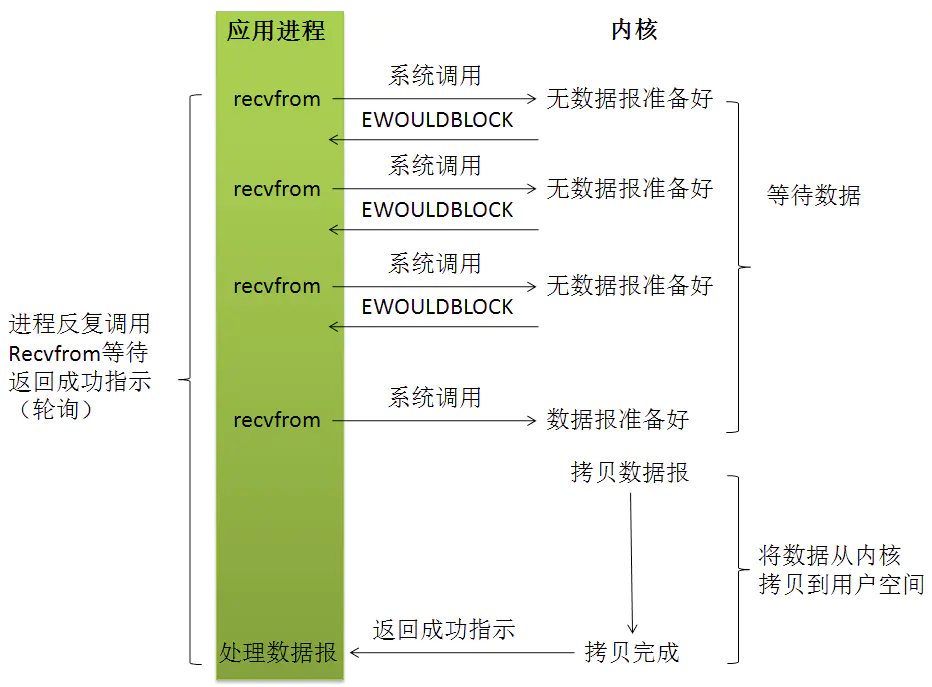

## 阻塞式 IO
id:: 66a70bcc-d3ac-4c4d-8b44-786d917e4727
	- 应用程序调用一个IO函数（recvfrom），导致应用程序阻塞，如果数据已经准备好，从内核拷贝到用户空间，否则一直等待下去。
	- 阻塞式 IO 的特点是在 IO 执行的两个阶段，用户线程都被阻塞了
	- {:height 399, :width 665}
- ## 非阻塞IO模型
	- 应用进程执行系统调用之后，内核返回一个错误码。应用进程可以继续执行，但是需要不断的执行系统调用来获知 I/O 是否完成，这种方式称为轮询(polling)。
		- 这对CPU时间是极大的浪费，但这种模型只是偶尔才遇到，一般是在只专门提供某种功能的系统中才有。
	- 非阻塞式 IO 的特点是用户进程需要不断地主动询问内核。
	- 非阻塞式 IO 在将数据从内核拷贝到用户空间的过程中仍然是阻塞的。
	- 
- ## IO 多路复用模型
  id:: 66a70caf-18a8-4097-a749-73a7c94c65db
	- 使用 select 或者 poll 等待数据，这个等待不同于阻塞式IO，此方法能够同时监听多个 socket，当其中任意一个的数据准备好了，就返回数据可读，再进行 recvfrom 系统调用，将数据由内核拷贝到用户进程（此过程是阻塞的）。
	- IO多路复用的特点是，将多个IO的阻塞复用到同一个 select 的阻塞上。
	- 它和阻塞式 IO 其实并没有太大的不同，事实上，还更差一些。因为这里需要使用两个system call (select 和 recvfrom)，而blocking IO只调用了一个system call (recvfrom)。但是，**用select的优势在于它可以同时处理多个connection**。
	- {:height 461, :width 780}
- ## 信号驱动式IO
	- 在信号驱动 IO 模型中，当用户线程发起一个 IO 请求操作，会给对应的 socket 注册一个信号函数
	- 然后用户线程会继续执行，当内核数据就绪时会发送一个信号给用户线程
	- 用户线程接收到信号之后，便在信号函数中调用 IO 读写操作来进行实际的 IO 请求操作。
- ## 异步 IO
  id:: 64e960c6-32d3-4da1-8b21-e0c6c9546a4e
	- 告知内核启动某个操作，并让内核在整个操作(包括将内核复制到我们自己的缓冲区)完成后通知我们，同时继续执行自己的进程任务。
	- 与信号驱动模型的主要区别在于：**信号驱动IO需要用户线程自己拷贝数据，而异步IO是由内核拷贝数据到用户空间的**。
	- {:height 460, :width 778}