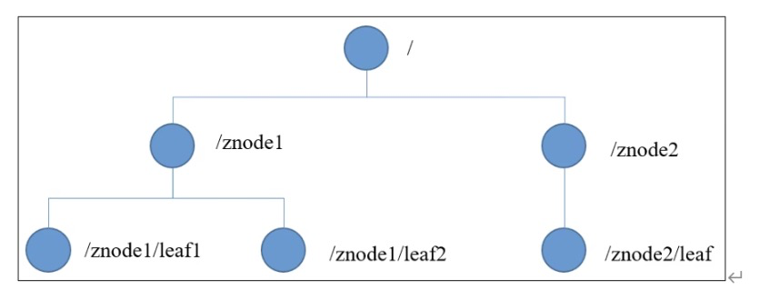

- # 基本介绍
- 基于观察者模式设计的分布式服务管理框架。负责管理存储和管理数据，接受观察者的注册，在数据状态发生变化时，通知已经注册的观察者。
- **特点**
	- 一个领导者（Leader），多个跟随者（Follower）组成的集群。
	- 集群中只要有半数以上节点存活，ZooKeeper集群就能正常服务。所以ZooKeeper**适合安装奇数台服务器**。
	- 全局数据一致：每个server保存一份相同的数据副本，客户端无论连接到哪个server，数据都是一致的。
	- 更新请求顺序执行。来自同一个客户端的更新请求按照其发送的顺序依次执行。
	- 数据更新原子性。
	- 实时性。在一定时间范围内，客户端能够读取到最新数据。
- # 应用场景
- 1. 统一命名服务
	- 在分布式环境下，经常需要对应用/服务进行统一命名，便于识别。
- 2. 统一配置管理
	- 在分布式环境中，需要对配置信息：1. 保持一致，2. 修改后快速同步。
	- 可以交由ZooKeeper处理：配置信息写入ZooKeeper上的一个ZNode，各个客户端监听这个ZNode。
- 3. 统一集群管理
	- 在分布式环境下，实时掌控每个节点的状态是有必要的。
	- 可将节点信息写入ZooKeeper上的一个ZNode，监听即可获取他的实时状态。
- 4. 服务器动态上下线
	- 客户端能够洞察服务器上下线的变化，通知监听者。业务服务器启动时创建临时节点，服务器断开后，自动删除节点信息，监听者对应变化
- 5. 软负载均衡
	- 在ZooKeeper中记录每台服务器的访问数，让访问数最少的服务器去处理最新的客户端请求。
- # 数据结构
- 其数据结构与Unix文件系统很类似，整体可以看作一棵树，每个节点称作一个ZNode，每个ZNode默认能够存储1MB的数据，每个ZNode都可以通过其路径唯一标识。
- 
- 节点类型：
	- 持久（persistent）：客户端与服务器断开连接后，创建的节点不删除
	- 短暂（ephemeral）：客户端与服务器断开连接后，创建的节点自动删除
	- 目录节点：ZooKeeper会给节点名称后面添加顺序编号
- 相关操作: ((64b7f6a3-8a9d-4475-bed3-9f6150643d76))
- ## 节点具体信息
- [[ZNode节点数据信息]]
- # 配置参数解读
- tickTime，通信心跳时间，服务器与客户端心跳时间，单位毫秒。
- initLimit，初始通信时限。Leader和Follower初始连接时能容忍的最多心跳数。
- syncLimit，同步通信时限。Leader和Follower通信时间如果超过syncLimit * tickTime，Leader认为Follower已下线，将从服务器中删除该Follower。
- dataDir，数据存储目录。
- clientPort，客户端通信端口号，默认2182。
- 集群参数：形如`server.A=B:C:D`
	- A是一个数字，代表这个是第几号服务器。
	  id:: 64b7dd39-c443-4edd-b47a-30a1142812af
		- 集群模式下在dataDir目录有一个myid文件，里面的信息即为当前服务器的ID数字。
		  id:: 64b7e52b-f1ac-4e19-8327-271c3b9f9885
	- B表示服务器地址。
	- C是这个服务器作为Follower时与集群中的Leader服务器交换信息的端口号。
	- D是当Leader挂掉，集群进行重新选举时，服务器间互相通信的端口号。
- # 客户端基础操作
  id:: 64b7f6a3-8a9d-4475-bed3-9f6150643d76
- `create <node_name> <node_desc>` 创建普通持久节点
- `create -s <node_name> <node_desc>`创建带编号的持久节点
- `create -e <node_name> <node_desc>`创建临时节点
- `create -s -e <node_name> <node_desc>`创建带编号的临时节点
- `get -s <node_name>` 获取节点的值与具体信息
- `stat <node_name>`获取节点的具体信息（不包含值）
- `set <node_name> <new_node_desc>` 修改节点内的值
- `delete <node_name>` 删除节点，有子节点时无法删除
- `deleteall <node_name>`递归删除节点
- # 选举机制
- [[ZooKeeper Leader选举机制]]
- # 监听器原理
- [[ZooKeeper 监听器原理]]
- # 写数据过程
- [[ZooKeeper 写数据过程]]
- # ZooKeeper应用案例
- [[ZooKeeper 实现分布式锁]]
- # 相关算法
- [[ZooKeeper 相关算法]]
-