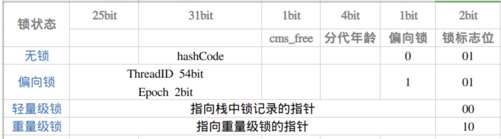

# 作用
- 原子性：被synchronized修饰的类或对象的所有操作都是原子的，因为在执行操作之前必须先获得类或对象的锁，直到执行完才能释放，这中间的过程无法被中断。
  logseq.order-list-type:: number
- 可见性：其中synchronized对一个类或对象加锁时，一个线程如果要访问该类或对象必须先获得它的锁，而这个锁的状态对于其他任何线程都是可见的，并且在释放锁之前会将 对变量的修改 刷新到主存当中，保证资源变量的可见性。
  logseq.order-list-type:: number
- 有序性：指令重排序会影响的是多线程并发执行的顺序性。synchronized保证了每个时刻都**只有一个线程访问同步代码块**，也就确定了线程执行同步代码块是分先后顺序的，保证了有序性。
  logseq.order-list-type:: number
- 可重入性：synchronized能够支持一个线程对资源重复加锁。
  logseq.order-list-type:: number
- # 用法
- 修饰普通方法。被修饰的方法称为同步方法，加锁的对象是调用这个方法的对象。
  logseq.order-list-type:: number
- 修饰静态方法。加锁的对象是当前类的类对象（不是指类的实例化对象，静态方法是属于类的，而不是对象的）。
  logseq.order-list-type:: number
- 修饰代码块。被修饰的代码块被称为同步语句块，加锁的对象是为括号里的具体内容。
  logseq.order-list-type:: number
	- 括号内可以为类的某个属性或者当前对象，加锁对象为类的实例对象。
	  logseq.order-list-type:: number
	- 也可以是类锁。Object.class，加锁对象为类对象，此时**类的所有对象**在此代码块到能保证线程同步）。
	  logseq.order-list-type:: number
- ```java
  class Foo implements Runnable {
      private byte[] lock = new byte[0];  // 特殊的instance变量
      Public void methodA() {
         synchronized(lock) { 
           // 加锁对象为当前类的实例对象
         }
         synchronized(Foo.class) {
           // 加锁对象为当前类的类对象，效果是类的所有对象在此都是同步的
         }
  	}
  //…..
  }
  ```
- # 原理
- 基本原理：通过内置的监视器锁monitor实现。
- **monitorenter**
	- 1. 每个对象有一个监视器锁（monitor）。当 monitor 被占用时就会处于锁定状态，线程执行 monitorenter 指令时尝试获取 monitor 的所有权，过程如下：
	- 2. 如果 monitor 的进入数为 0，则该线程进入 monitor，然后将进入数设置为 1，该线程即为 monitor 的所有者。
	- 3. 如果线程已经占有该 monitor，只是重新进入，则进入 monitor 的进入数加1。（可重入）
	- 4. 如果其他线程已经占用了 monitor，则该线程进入阻塞状态，直到 monitor 的进入数为0，再重新尝试获取monitor的所有权
- **monitorexit**
	- 1. 执行 monitorexit 的线程必须是 objectref 所对应的 monitor 的所有者。
	- 2. 指令执行时，monitor 的进入数减1，如果减1后进入数为0，那线程退出 monitor，不再是这个 monitor 的所有者。其他被这个 monitor 阻塞的线程可以尝试去获取这个 monitor 的所有权。
- 如果再深入到源码来说，synchronized实际上有两个队列waitSet和entryList。
	- 当多个线程进入同步代码块时，首先进入entryList
	- 有一个线程获取到monitor锁后，就赋值给当前线程，并且计数器+1
	- 如果线程调用wait方法，将释放锁，当前线程置为null，计数器-1，同时进入waitSet等待被唤醒，调用notify或者notifyAll之后又会进入entryList竞争锁
	- 如果线程执行完毕，同样释放锁，计数器-1，当前线程置为null
- ## 实现原理
- 对象存储在堆中，主要分为三部分内容：对象头、对象实例数据、对齐填充。
- 对象头部分包含有`Mark Word`部分，synchronized与这一部分息息相关。
- 在JDK1.6之前，synchronized只实现了重量级锁，是基于monitor实现的，[[ObjectMonitor数据结构]] 中有几个值得关注的成员变量：
	- `_owner`：持锁者。指向获得ObjectMonitor对象的线程。（即获得锁的线程）
	- `_EntryList`：锁池。处于等待锁block状态的线程，会被加入到这里。
	- `_WaitSet`：等待集合。处理wait状态的线程，会被加入到这里。（调用同步对象wait方法）
- 其过程如下：
	- 1. 当多个线程同时访问同步代码块时，首先会进入到EntryList中，然后通过CAS的方式尝试将Monitor中的owner字段设置为当前线程，同时count加1，若发现之前的owner的值就是指向当前线程的，recursions也需要加1。如果CAS尝试获取锁失败，则进入到EntryList中。
	- 2.当获取锁的线程调用`wait()`方法，则会将owner设置为null，同时count减1，recursions减1，当前线程加入到WaitSet中，等待被唤醒。
	- 3.当前线程执行完同步代码块时，则会释放锁，count减1，recursions减1。当recursions的值为0时，说明线程已经释放了锁。
- > 这就是为什么`wait()`、`notify()`等方法要在同步方法或同步代码块中来执行呢，这里就能找到原因，是因为`wait()`、`notify()`方法需要借助ObjectMonitor对象内部方法来完成。
- ## JDK1.6中的优化
- 在JDK1.6中，为了减少获得锁和释放锁带来的性能消耗，引入了偏向锁和轻量级锁，锁的状态变成了四种。
- 锁的状态会随着竞争激烈逐渐升级，但通常情况下，锁的状态只能升级不能降级。这种只能升级不能降级的策略是为了提高获得锁和释放锁的效率。
- 但是在一定情况下也会发生锁的降级，**锁的降级只会发生轻量级锁到无锁，或重量级锁到无锁**，不会降级到偏向锁，因为在竞争状态下偏向锁比轻量级锁更消耗性能。
- {:height 226, :width 780}
- ### 偏向锁
- 作用：减少只有一个线程执行代码块时的性能消耗，缺点是存在竞争时会带来额外的锁撤销操作。
- 获取过程：
	- 当锁对象第一次被线程获取时，虚拟机把锁标志位设为01。同时使用CAS操作，记录线程的ID到`Mark Word` 中，并将偏向锁的状态位置设为1。
	  logseq.order-list-type:: number
	- 线程每次进入同步块时，检查`Mark Word` 中的`Thread ID`与自身线程的ID是否一致。如果一直则认为当前线程已经获取到锁，不在进行其他同步操作。
	  logseq.order-list-type:: number
	- 当有线程尝试获取锁，但发现`Thread ID`不一致，则竞争失败，升级为轻量级锁。
	  logseq.order-list-type:: number
- 简单来说，就是通过CAS操作将当前的线程ID记录到对象头的Mark Word中，下次进入对比线程ID。
- 撤销过程：
	- 必须等待全局安全点
	  logseq.order-list-type:: number
	- 暂停拥有偏向锁的线程，判断锁对象是否处于被锁定的状态
	  logseq.order-list-type:: number
	- 撤销偏向锁恢复到无锁或者轻量级锁状态
	  logseq.order-list-type:: number
- ### 轻量级锁
- 作用：在多线程交替执行同步代码块时（即未发生竞争），避免使用重量级锁带来的性能消耗。
- 大致原理：每个线程都会维护一个自己的`LockRecord`（LR），每个线程在竞争锁的时候，都尝试将锁对象头中的Mark Word设置为指向自己的指针，获取成功则持有锁，获取失败则CAS自旋继续获取，失败超过一定次数就膨胀为重量级锁。
- 获取过程：
	- 复制锁记录：在代码进入同步块前，如果该同步块没有被锁定（锁的标志位为“01”），则JVM在当前线程的栈帧中，创建一个锁记录`LockRecord`，并将锁对象头中的`Mark Word`信息复制到LR中，这个过程称之为`Displaced Mark Word`。
	  logseq.order-list-type:: number
	- 尝试使用CAS操作，将对象头中的Mark Word 替换为指向锁记录的指针。
	  logseq.order-list-type:: number
	- 如果成功了，则表示获取到了该对象的锁，将Mark Word的锁标志为转变为“00”，表示处于轻量级锁定状态。
	  logseq.order-list-type:: number
	- 如果失败，且MarkWord未指向当前线程栈帧中的锁记录，表示有其他线程在竞争锁，当前线程使用`自旋`来获取。**自旋一定次数仍然失败后，则升级为重量级锁**。
	  logseq.order-list-type:: number
- 简单来说：将对象的Mark Word复制到当前线程的Lock Record中，并将对象的Mark Word更新为指向Lock Record的指针。
- 解锁过程：
	- 通过CAS操作，将Lock Record中的Mark Word替换回来。如果成功表示没有竞争发生，成功释放锁，恢复到无锁的状态；如果失败，表示当前锁存在竞争，升级为重量级锁。
- ### 自旋锁
- 引入自旋锁的原因：因为阻塞和唤起线程都会引起操作系统用户态和核心态的转变，对系统性能影响较大，而自旋等待可以避免线程切换的开销。
- 优点：避免了线程切换的开销，提升系统性能。
- 缺点：会占用处理器时间。如果持有锁的线程很长时间都不释放锁，自旋的线程就会白白浪费资源，因此自旋次数会做出设置。
- ### 重量级锁
- 当线程的自旋次数过长依旧没获取到锁，为避免CPU无端耗费，锁由轻量级锁升级为重量级锁。获取锁的同时会阻塞其他正在竞争该锁的线程，依赖对象内部的监视器（monitor）实现，monitor又依赖操作系统底层，需要从用户态切换到内核态，成本非常高。
- >**为什么成本高？**当系统检查到锁是重量级锁之后，会把等待想要获得锁的线程进行阻塞，被阻塞的线程不会消耗cpu。但是阻塞或者唤醒一个线程时，都需要操作系统来帮忙，这就需要从用户态转换到内核态，而转换状态是需要消耗很多时间的，有可能比用户执行代码的时间还要长。