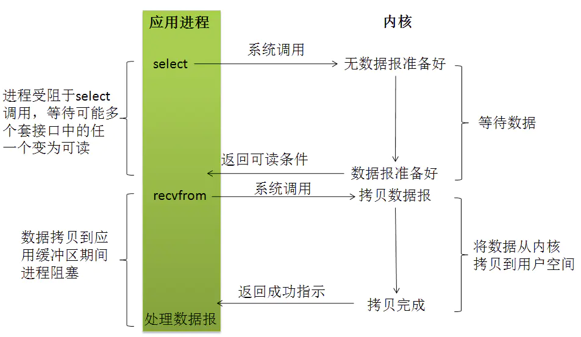

- 使用 select 或者 poll 等待数据，这个等待不同于阻塞式IO，此方法能够同时监听多个 socket，当其中任意一个的数据准备好了，就返回数据可读，再进行 recvfrom 系统调用，将数据由内核拷贝到用户进程（此过程是阻塞的）。
- IO多路复用的特点是，将多个IO的阻塞复用到同一个 select 的阻塞上。
- 它和阻塞式 IO 其实并没有太大的不同，事实上，还更差一些。因为这里需要使用两个system call (select 和 recvfrom)，而blocking IO只调用了一个system call (recvfrom)。但是，用select的优势在于它可以同时处理多个connection。
- 