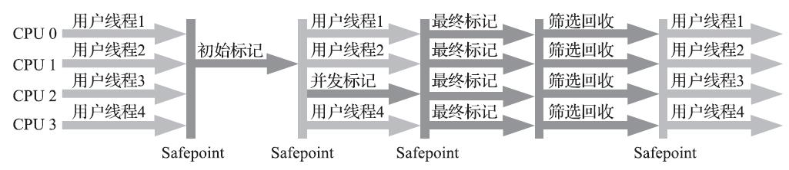

# CMS
- CMS（Concurrent Mark Sweep）收集器是一种以**获取最短回收停顿时间为目标**的收集器。从名字可以看出其基于标记-清除算法，他的运作过程分为四步:
	- 1.	**初始标记**（CMS initial mark）该步骤只是标记一下与 GC Roots 能直接关联到的对象，速度很快。需要“Stop the World”
	- 2.	**并发标记**（CMS concurrent mark）该步骤就是从GC Roots的直接关联对象开始，遍历整个对象图的过程，这个过程耗时较长但是不需要停顿用户线程，可以与垃圾收集线程一起并发运行
	- 3.	**重新标记**（CMS remark）该过程是为了修正并发标记期间，因用户程序继续运作而导致标记产生变动的那一部分的对象，这一阶段的停顿时间会比初始标记时间长，但远短于并发标记时间。需要“Stop the World”
	- 4.	**并发清除**（CMS concurrent sweep）清除掉标记阶段判断已死亡的对象，由于不需要移动活的对象，这个阶段与用户线程同时并发
- 
- 优点：并发收集（即可以与用户线程同时进行），低停顿
- 缺点：
	- 1. 在并发阶段，占用用户线程，导致程序变慢，降低总吞吐量；
	- 2. 需要为并发过程中产生的“浮动垃圾”预留空间，如果预留空间设置不当，会出现并发失败的情况；
	- 3. CMS 使用的是标记-清除算法，可能会产生大量空间碎片，无法拥有足够的空闲空间分配大对象，出发 FullGC
- # Garbage First
- G1 可以面向堆内存任何部分来组成回收集（Collection Set，一般简称CSet）进行回收，衡量标准不再是它属于哪个分代，而是哪块内存中存放的垃圾数量最多，回收收益最大。
- G1开创的基于Region的堆内存布局是它能够实现这个目标的关键：
- > G1不再坚持固定大小以及固定数量的分代区域划分，而是把连续的Java堆划分为多个大小相等的独立区域（Region），每一个Region都可以根据需要，扮演新生代的Eden空间、Survivor空间，或者老年代空间。收集器能够对扮演不同角色的Region采用不同的策略去处理，这样无论是新创建的对象还是已经存活了一段时间、熬过多次收集的旧对象都能获取很好的收集效果。
- > 虽然G1仍然保留新生代和老年代的概念，但新生代和老年代不再是固定的了，它们都是一系列区域（不需要连续）的动态集合。G1收集器之所以能建立可预测的停顿时间模型，是因为它将Region作为单次回收的最小单元，即每次收集到的内存空间都是Region大小的整数倍，这样可以有计划地避免在整个Java堆中进行全区域的垃圾收集。
- {:height 491, :width 653}
- G1 收集器的运作过程大致可以划分为以下几步：
	- 1.	初始标记。标记一下 GC Roots 能直接关联的对象。需要停顿线程，但是耗时很短
	- 2.	并发标记。对堆中的对象进行可达性分析，扫描整个堆里要回收的对象。耗时较长，但可以与用户线程并发执行
	- 3.	最终标记。对用户线程做一个短暂的暂停，用于处理并发时，引用变动的对象
	- 4.	筛选回收。更新 Region 的统计数据，对各个 Region 的回收价值和成本进行排序，根据用户期望的停顿时间来制定回收计划，把决定回收的一部分的 Region 的存活对象复制到空的 Region 中，清理掉旧的 Region 空间（标记复制）。**涉及转移存活对象，必须暂停用户线程**
- 
- G1 回收器在筛选回收阶段，可以设置期望停顿时间，如果这个停顿时间设置得太短，可能导致每次选出来的回收集只占用堆内存的一小部分，收集器收集的速度跟不上分配器分配的速度。
- # ZGC
- The Z Garbage Collector。是JDK 11中推出的一款低延迟垃圾回收器，它的设计目标包括：
	- 停顿时间不超过10ms；
	- 停顿时间不会随着堆的大小，或者活跃对象的大小而增加；
	- 支持8MB~4TB级别的堆（未来支持16TB）。
- 
- 其解决的痛点是G1标记--复制过程中的转移阶段的STW停顿过长。主要因为是G1未能解决转移过程中准确定位对象地址的问题。
- ZGC只有三个STW阶段：**初始标记**，**再标记**，**初始转移**。
	- 其中，初始标记和初始转移分别都只需要扫描所有GC Roots，其处理时间和GC Roots的数量成正比，一般情况耗时非常短；
	- 再标记阶段STW时间很短，最多1ms，超过1ms则再次进入并发标记阶段。
	- 即，ZGC几乎所有暂停都只依赖于GC Roots集合大小，停顿时间不会随着堆的大小或者活跃对象的大小而增加。与ZGC对比，G1的转移阶段完全STW的，且停顿时间随存活对象的大小增加而增加。
- ZGC通过**着色指针**和**读屏障技术**，解决了转移过程中准确访问对象的问题，实现了并发转移。
- > 大致原理描述如下：并发转移中“并发”意味着GC线程在转移对象的过程中，应用线程也在不停地访问对象。假设对象发生转移，但对象地址未及时更新，那么应用线程可能访问到旧地址，从而造成错误。而在ZGC中，应用线程访问对象将触发“读屏障”，如果发现对象被移动了，那么“读屏障”会把读出来的指针更新到对象的新地址上，这样应用线程始终访问的都是对象的新地址。那么，JVM是如何判断对象被移动过呢？就是利用对象引用的地址，即着色指针。
- ---
- 以下为较老旧的垃圾回收器
- ---
- # Serial
- Serial收集器是最基础、历史最悠久的收集器，这个收集器是一个单线程工作的收集器，因此在进行垃圾回收时，必须暂停其他所有工作线程（StopThe World）
- 
- 缺点：需要暂停所有工作线程，出现较长时间的停顿，体验很差
- 优点：简单高效，额外内存消耗小，也没有线程交互的开销
- 主要可在客户端模式下使用
- # ParNew
- ParNew 收集器实质上是 Serial 收集器的多线程并行版本，除了同时使用多条线程进行垃圾收集之外，其余的行为与 Serial 收集器一致
- 
- 作为新生代收集器，除了 Serial 收集器外，目前只有它能与 CMS 收集器（老年代收集器）配合工作。（原因是，后续的垃圾回收器未使用 HotSpot 原本设计的分代回收框架）如今，ParNew 合并入 CMS，成为他专门处理新生代的组成部分。
- 优点：在多核场景下，优于 Serial 收集器
- #
- # Parallel Scavenge
- Parallel Scavenge 也是新生代收集器，也是基于标记-复制算法实现的收集器，也是能够并行收集的收集器，其特点在于：其他收集器尽可能缩短垃圾回收时，用户线程的停顿时间，而该收集器的目标是**达到一个可控制的吞吐量**，即处理器用于运行用户代码的时间与处理器总消耗时间的比值：
- # Serial Old
- Serial Old 即为 Serial 收集器的老年代版本，它同样是个单线程收集器，使用标记-整理算法，这个收集器的主要意义，也是供客户端模式下的 HotSpot 虚拟机使用，在服务端模式下，有两种用途，一种是在JDK 5以及之前的版本中与Paral-lel Scavenge收集器搭配使用，另外一种就是作为CMS收集器发生失败时的后备预案。
- 
- # Parallel Old
- Parallel Old是Parallel Scavenge收集器的老年代版本，支持多线程并发收集，基于标记-整理算法实现。其主要作用是与 Parallel Scavenge 收集器搭配，达到良好的可控吞吐量目标。
- 