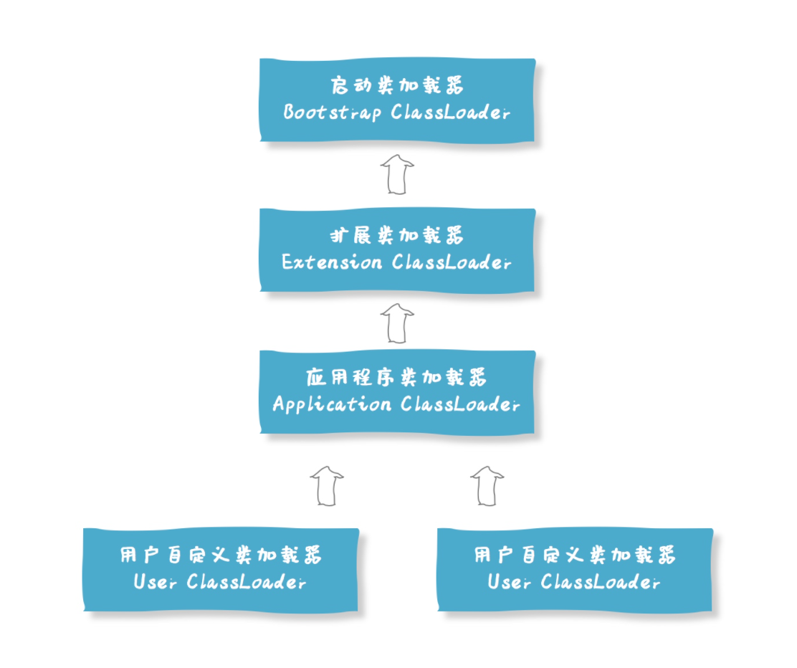

- **任意一个类都是由这个类本身，和加载这个类的类加载器，来确定这个类在JVM中的唯一性**
- Java语言系统支持以下四种类加载器：
	- Bootstrap ClassLoader 启动类加载器。主要负责加载 Java 核心类库，%JRE_HOME%\lib 下的 rt.jar、resources.jar、charsets.jar 和 class 等
	- Extension ClassLoader 标准扩展类加载器。主要负责加载目录 %JRE_HOME%\lib\ext 目录下的 jar 包和 class 文件。
	- Application ClassLoader 应用类加载器。主要负责加载当前应用的 classpath 下的所有类。
	- User ClassLoader 用户自定义类加载器。用户自定义的类加载器, 可加载指定路径的 class 文件
- 注意其之间不是继承的关系，而是逻辑上的调用顺序关系
- 
- 其中前三种由 java 提供，最后一种由用户自定义。这几种类加载器存在有层级关系：
- # 类的加载方式
- 1. 命令行启动应用时候由 JVM 初始化加载
- 2. 通过 `Class.forName()` 方法动态加载
- 3. 通过 `ClassLoader.loadClass()` 方法动态加载
- # JVM 类加载机制
- ### 全盘负责
	- 当一个类加载器负责加载某个Class时，该Class所依赖的和引用的其他Class也将由该类加载器负责载入，除非显示使用另外一个类加载器来载入。
- ### 缓存机制
	- 缓存机制将会保证所有加载过的Class都会被缓存，当程序中需要使用某个Class时，类加载器先从缓存区寻找该Class，只有缓存区不存在，系统才会读取该类对应的二进制数据，并将其转换成Class对象，存入缓存区。这就是为什么修改了Class后，必须重启JVM，程序的修改才会生效。
- ### 双亲委派机制
	- 如下。
- # 双亲委派模型
- 当一个类加载器接收到需要加载类的请求时，它会将这个请求委派给父加载器去完成，每一层都是如此，直到顶层启动类加载器。只有当父加载器无法完成加载时，才由当前加载器来负责类的加载。
- ## 为什么需要
- 1. 可避免类的重复加载。父加载器已经加载的类，子加载器不会重复去加载。
- 2. 保证安全性。不同层级的类加载器对应不同层次的类：核心类 -> 扩展类 -> 应用类，能够使得核心代码不被破坏。
- ## 实现
- 主要方法如下：
	- 1. 先检查类是否已经被加载过
	- 2. 如果没有则调用父类的加载器的方法进行加载（递归）
	- 3. 如果父类加载器为空，则调用启动类加载器进行加载
	- 4. 如果父类加载失败抛出异常后，调用自己的 findClass() 进行加载
- 代码主要集中在 java.lang.ClassLoader 的 loadClass() 方法之中：
- ```java
  protected Class<?> loadClass(String name, boolean resolve) throws ClassNotFoundException
    {
        synchronized (getClassLoadingLock(name)) {
            // First, check if the class has already been loaded
            Class<?> c = findLoadedClass(name);
            if (c == null) {
                long t0 = System.nanoTime();
                try {
                    if (parent != null) {
                        c = parent.loadClass(name, false);
                    } else {
                        c = findBootstrapClassOrNull(name);
                    }
                } catch (ClassNotFoundException e) {
                    // ClassNotFoundException thrown if class not found
                    // from the non-null parent class loader
                }
  
                if (c == null) {
                    // If still not found, then invoke findClass in order
                    // to find the class.
                    long t1 = System.nanoTime();
                    c = findClass(name);
  
                    // this is the defining class loader; record the stats
                    sun.misc.PerfCounter.getParentDelegationTime().addTime(t1 - t0);
                    sun.misc.PerfCounter.getFindClassTime().addElapsedTimeFrom(t1);
                    sun.misc.PerfCounter.getFindClasses().increment();
                }
            }
            if (resolve) {
                resolveClass(c);
            }
            return c;
        }
  ```
- # 破坏
- 要破坏双亲委派模型，则只需要自定义一个类加载器，重写其中的 loadClass() 方法使其不进行双亲委派即可。
- ## 破坏的例子
- 1. **JDBC 等需要加载 SPI 接口实现类的情况**
	- 正常情况是由基础类来提供服务的，但是有的情况下，系统仅提供服务的接口，由第三方提供具体的实现。那么根据双亲委派模型，第三方的类不能够由根加载器加载。解决方式就是重写相关加载方法。
- 2. **Tomcat 等容器**
- > 不同的应用程序可能会依赖同一个第三方类库的不同版本，但是不同版本的类库中某一个类的全路径名可能是一样的。如多个应用都要依赖 hollis.jar，但是 A 应用需要依赖 1.0.0 版本，但是 B 应用需要依赖 1.0.1 版本。这两个版本中都有一个类是 com.hollis.Test.class。
- > **如果采用默认的双亲委派类加载机制，那么是无法加载多个相同的类。**
- > 所以，**Tomcat 破坏双亲委派原则，提供隔离的机制，为每个 web 容器单独提供一个 WebAppClassLoader 加载器。**
- 3. **模块化技术与类加载机制**
- > 近几年模块化技术已经很成熟了，在 JDK 9 中已经应用了模块化的技术。其实早在 JDK 9 之前，OSGI 这种框架已经是模块化的了，**而 OSGI 之所以能够实现模块热插拔和模块内部可见性的精准控制都归结于其特殊的类加载机制，加载器之间的关系不再是双亲委派模型的树状结构，而是发展成复杂的网状结构。**
- 参考: [关于JVM类加载机制，看这一篇就够了](https://juejin.cn/post/6865572557329072141)